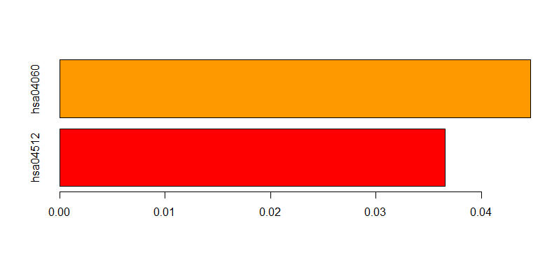

```
--------[p.48]-------------------------------------------------------------
GO enrichment of genes

＜オントロジ割当のEnrichment解析とは＞

The GO enrichment of genes

Enrichment analysis(またはHypergeometric test)で、発現遺伝子のセットがどのGOにあてはまるかを統計的にテストします。

＜Enrichment解析の説明＞
まずゲノムワイドな遺伝子セットについてGOのTerm別で分布をカウントしておきます。知りたいクエリの遺伝子セット（例：Microarray解析でのUp-regulated genesセット）について、GO　Termの分布をカウントします。GOTerm毎に、ゲノムワイドな遺伝子セット(background dataset)と比較して有意に多いかP値で表します。分布の検定には、超幾何分布検定(hypergeometric test)もしくはFisherの正確確率検定(Fisher's exact test)が使われます。


--------------[スライド中のfisher’s exact test実行]----------------------------------
参考：
http://jura.wi.mit.edu/bio/education/hot_topics/enrichment/Gene_list_enrichment_Mar10.pdf

> counts = (matrix(data = c(3, 297, 40, 19960), nrow = 2))
> counts
     [,1]  [,2]
[1,]    3    40
[2,]  297 19960

> out<-fisher.test(counts)
> out

	Fisher's Exact Test for Count Data

data:  counts
p-value = 0.02552
alternative hypothesis: true odds ratio is not equal to 1
95 percent confidence interval:
  0.9918169 15.9604612
sample estimates:
odds ratio 
  5.039206 

-----[p.48]--------------------------------------


> source("http://Bioconductor.org/biocLite.R")
Bioconductor version 3.1 (BiocInstaller 1.18.4), ?biocLite for help
> biocLite(c("topGO","ALL"))
trying URL 'http://bioconductor.org/packages/3.1/bioc/bin/windows/contrib/3.2/BiocInstaller_1.18.5.zip'
Content type 'application/zip' length 56465 bytes (55 KB)
downloaded 55 KB

> library(topGO)
 要求されたパッケージ BiocGenerics をロード中です 
 要求されたパッケージ parallel をロード中です 

＜略＞

> library(ALL)
> data(ALL)
> data(geneList)
> summary(ALL)
       Length         Class          Mode 
            1 ExpressionSet            S4 
> summary(geneList)
   Min. 1st Qu.  Median    Mean 3rd Qu.    Max. 
0.00000 0.09917 0.62240 0.55320 1.00000 1.00000 
> dim(geneList)
NULL
> head(geneList)
1095_s_at   1130_at   1196_at 1329_s_at 1340_s_at 1342_g_at 
1.0000000 1.0000000 0.6223795 0.5412240 1.0000000 1.0000000 
> dim(ALL)
Features  Samples 
   12625      128 
> head(ALL)
ExpressionSet (storageMode: lockedEnvironment)
assayData: 1 features, 128 samples 
  element names: exprs 
protocolData: none
phenoData
  sampleNames: 01005 01010 ... LAL4 (128 total)
  varLabels: cod diagnosis ... date last seen (21 total)
  varMetadata: labelDescription
featureData: none
experimentData: use 'experimentData(object)'
  pubMedIds: 14684422 16243790 
Annotation: hgu95av2 


>  affyname <- paste(annotation(ALL), "db", sep=".")

> biocLite(affyname)　＃本と異なるので注意
BioC_mirror: http://bioconductor.org
Using Bioconductor version 3.1 (BiocInstaller 1.18.5), R version 3.2.2.
Installing package(s) ‘hgu95av2.db’
installing the source package ‘hgu95av2.db’
＜略＞


> topDiffGenes(geneList)
 1095_s_at    1130_at    1196_at  1329_s_at  1340_s_at  1342_g_at    1347_at    1361_at 
     FALSE      FALSE      FALSE      FALSE      FALSE      FALSE       TRUE      FALSE 

＜略＞

  506_s_at     563_at     989_at 
      TRUE      FALSE       TRUE 
> sum(topDiffGenes(geneList))
[1] 50


> myGO <- new("topGOdata",ontology="BP",allGenes=geneList,geneSel=topDiffGenes,nodeSize=10,annot=annFUN.db,affyLib=affyname)

Building most specific GOs .....
Loading required package: hgu95av2.db
Loading required package: org.Hs.eg.db


	( 1376 GO terms found. )

Build GO DAG topology ..........	( 3902 GO terms and 9217 relations. )

Annotating nodes ...............	( 310 genes annotated to the GO terms. )


 
> out1 <- runTest(myGO,algorithm="classic",statistic="fisher")

			 -- Classic Algorithm -- 

		 the algorithm is scoring 938 nontrivial nodes
		 parameters: 
			 test statistic:  fisher 
> out1

Description:  
Ontology: BP 
'classic' algorithm with the 'fisher' test
1015 GO terms scored: 72 terms with p < 0.01
Annotation data:
    Annotated genes: 310 
    Significant genes: 46 
    Min. no. of genes annotated to a GO: 10 
    Nontrivial nodes: 938 

> summary(out1)
     Length       Class        Mode 
          1 topGOresult          S4 


> score(out1)
  GO:0000003   GO:0000070   GO:0000075   GO:0000077   GO:0000079   GO:0000082   GO:0000086 
0.6869641900 0.9971382112 0.9439362205 0.6004677549 0.8053541242 0.9640055629 0.8222440022 
＜略＞


> summary(out1)
     Length       Class        Mode 
          1 topGOresult          S4 

> out2 <- runTest(myGO,algorithm="classic",statistic="ks")

			 -- Classic Algorithm -- 

		 the algorithm is scoring 1015 nontrivial nodes
		 parameters: 
			 test statistic:  ks 
			 score order:  increasing 
> 
> out2

Description:  
Ontology: BP 
'classic' algorithm with the 'ks' test
1015 GO terms scored: 87 terms with p < 0.01
Annotation data:
    Annotated genes: 310 
    Significant genes: 46 
    Min. no. of genes annotated to a GO: 10 
    Nontrivial nodes: 1015 


> tab1 <- GenTable(myGO, classifFisher=out1,topNodes=20)
> 
> head(tab1)
       GO.ID                                        Term Annotated Significant Expected
1 GO:0002252                     immune effector process        33          13     4.90
2 GO:0001909             leukocyte mediated cytotoxicity        11           7     1.63
3 GO:0032946 positive regulation of mononuclear cell ...        34          13     5.05
4 GO:0050671 positive regulation of lymphocyte prolif...        34          13     5.05
5 GO:0070665 positive regulation of leukocyte prolife...        34          13     5.05
6 GO:0042102 positive regulation of T cell proliferat...        31          12     4.60
  classifFisher
1       0.00021
2       0.00021
3       0.00030
4       0.00030
5       0.00030
6       0.00048


> tab2 <- GenTable(myGO, classicKS=out2,topNodes=20)
> head(tab2)
       GO.ID                       Term Annotated Significant Expected classicKS
1 GO:0007049                 cell cycle       197          27    29.23   5.4e-11
2 GO:0022402         cell cycle process       184          23    27.30   6.9e-10
3 GO:1903047 mitotic cell cycle process       177          19    26.26   1.1e-09
4 GO:0000278         mitotic cell cycle       182          22    27.01   1.2e-09
5 GO:0000280           nuclear division       175          17    25.97   1.9e-09
6 GO:0007067   mitotic nuclear division       175          17    25.97   1.9e-09


> tab_all<-GenTable(myGO, cl_Fisher=out1,cl_KS=out2,ranksOf = "cl_Fisher",topNodes=10)
> 
> tab_all
        GO.ID                                        Term Annotated Significant Expected
1  GO:0002252                     immune effector process        33          13     4.90
2  GO:0001909             leukocyte mediated cytotoxicity        11           7     1.63
3  GO:0032946 positive regulation of mononuclear cell ...        34          13     5.05
4  GO:0050671 positive regulation of lymphocyte prolif...        34          13     5.05
5  GO:0070665 positive regulation of leukocyte prolife...        34          13     5.05
6  GO:0042102 positive regulation of T cell proliferat...        31          12     4.60
7  GO:0030098                  lymphocyte differentiation        23          10     3.41
8  GO:0030217                      T cell differentiation        23          10     3.41
9  GO:0050870    positive regulation of T cell activation        32          12     4.75
10 GO:0032943              mononuclear cell proliferation        37          13     5.49
   Rank in cl_Fisher cl_Fisher  cl_KS
1                  1   0.00021 0.0029
2                  2   0.00021 0.0024
3                  3   0.00030 0.0084
4                  4   0.00030 0.0084
5                  5   0.00030 0.0084
6                  6   0.00048 0.0114
7                  7   0.00052 0.0028
8                  8   0.00052 0.0028
9                  9   0.00068 0.0149
10                10   0.00081 0.0177


> gostat<- termStat(myGO, names(score(out1)))
> head(gostat)
           Annotated Significant Expected
GO:0000003        59           8     8.75
GO:0000070        58           3     8.61
GO:0000075        55           5     8.16
GO:0000077        13           2     1.93
GO:0000079        19           2     2.82
GO:0000082        20           1     2.97
> 

> plot(score(out1),score(out2))


> head(gostat$Annotated)
[1] 59 58 55 13 19 20

> val<-gostat$Annotated　分かり易く変数代入

> plot(score(out1),score(out2),cex=4*(val/max(val)))

> plot(score(out1),score(out2),cex=4*(val/max(val)),
col=heat.colors(gostat$Significant))　有意な程scoreを赤色に 


> biocLite("Rgraphviz")   ネットワーク図用のグラフライブラリ
BioC_mirror: http://bioconductor.org
Using Bioconductor version 3.1 (BiocInstaller 1.18.5), R version
  3.2.2.
Installing package(s) ‘Rgraphviz’
trying URL 'http://bioconductor.org/packages/3.1/bioc/bin/windows/contrib/3.2/Rgraphviz_2.12.0.zip'
Content type 'application/zip' length 3663538 bytes (3.5 MB)
downloaded 3.5 MB

package ‘Rgraphviz’ successfully unpacked and MD5 sums checked

The downloaded binary packages are in
	C:\Users\ekaminuma\AppData\Local\Temp\RtmpYvq03d\downloaded_packages
Old packages: 'doParallel', 'foreach', 'iterators', 'manipulate',
  'snow', 'stringi', 'class', 'foreign', 'MASS', 'mgcv', 'nlme',
  'nnet', 'spatial'
Update all/some/none? [a/s/n]: 
n

> library(Rgraphviz)


> showSigOfNodes(myGO,score(out1),firstSigNodes=3)　トップから3階層目まで表示
Loading required package: Rgraphviz
Loading required package: grid

Attaching package: ‘grid’

 以下のオブジェクトは ‘package:topGO’ からマスクされています: 

     depth 

$dag
A graphNEL graph with directed edges
Number of Nodes = 22 
Number of Edges = 36 

$complete.dag
[1] "A graph with 22 nodes."


```

```
----------[p.52]----------------------------------------------------------------------

> source("http://Bioconductor.org/biocLite.R")
Bioconductor version 3.1 (BiocInstaller 1.18.4), ?biocLite for help

> biocLite("clusterProfiler") BioC_mirror: http://bioconductor.org Using Bioconductor version 3.1 (BiocInstaller 1.18.4), R version 3.2.2. Installing package(s) ‘clusterProfiler’ also installing the dependencies ‘xtable’, ‘iterators略

> library(clusterProfiler)
> data(gcSample)
> genes<-gcSample[[3]]
> genes
  [1] "894"       "7057"      "22906"     "3339"      "10449"    
略
[386] "26137"     "4626"      "54629"     "91860"     "57707"    
[391] "388969"    "11057"    
> summary(genes)
   Length     Class      Mode 
      392 character character 

----------Enrichment解析によるPathwayランキング-----------------


> kegg_en<-enrichKEGG(gene=genes,organism="human",pvalueCutoff=0.05,qvalueCutoff=0.05,readable=T)   本と違うので注意


> kegg_en
392 human Genes to  KEGG  test for over-representation. 
 with p value < 0.05 
> 
> kegg_f <- summary(kegg_en)
> kegg_f
               ID                            Description GeneRatio  BgRatio       pvalue
hsa04512 hsa04512               ECM-receptor interaction     9/163  87/6969 0.0001806948
hsa04060 hsa04060 Cytokine-cytokine receptor interaction    16/163 265/6969 0.0004420219
           p.adjust     qvalue
hsa04512 0.03957216 0.03651937
hsa04060 0.04840139 0.04466747
                                                                                                          geneID
hsa04512                                                  THBS1/HSPG2/ITGB7/CHAD/ITGA7/LAMA4/ITGB8/COL11A2/ITGB5
hsa04060 CXCL1/TNFRSF11B/LIFR/XCL1/GDF5/TNFRSF17/TNFRSF11A/IL5RA/HGF/EPOR/CSF2RA/TNFRSF25/BMP7/IL21R/IL23A/TGFB2
         Count
hsa04512     9
hsa04060    16


> 
> barplot(kegg_f[,7],horiz=T,col=rainbow(10),names.arg=kegg_f[,1])
　　　   qvalueの値をグラフ化


```



```
----------複数データでの比較-------------------------------------------------


> summary(gcSample)
   Length Class  Mode     
X1 216    -none- character
X2 805    -none- character
X3 392    -none- character
X4 838    -none- character
X5 929    -none- character
X6 585    -none- character
X7 582    -none- character
X8 237    -none- character


> summary(gcSample[[3]])
   Length     Class      Mode 
      392 character character 

 
> ck <- compareCluster(geneCluster=gcSample, fun="enrichKEGG",use_internal_data=TRUE)


> ck
Result of Comparing 8 gene clusters 

> summary(ck)
   Cluster       ID                           Description GeneRatio  BgRatio       pvalue
1       X2 hsa04110                            Cell cycle    18/297 128/5894 6.383147e-05
2       X2 hsa05340              Primary immunodeficiency     8/297  35/5894 2.698906e-04
3       X3 hsa04512              ECM-receptor interaction     9/152  85/5894 3.077198e-04
4       X4 hsa03030                       DNA replication    10/326  36/5894 1.632995e-05
5       X4 hsa04110                            Cell cycle    20/326 128/5894 1.997779e-05
6       X4 hsa00240                 Pyrimidine metabolism    16/326  99/5894 8.987559e-05
7       X4 hsa05215                       Prostate cancer    15/326  89/5894 9.112870e-05
8       X4 hsa05200                    Pathways in cancer    33/326 327/5894 4.901026e-04
9       X4 hsa04910             Insulin signaling pathway    18/326 138/5894 5.390480e-04
10      X4 hsa04510                        Focal adhesion    23/326 200/5894 6.083254e-04
11      X4 hsa04710             Circadian rhythm - mammal     6/326  23/5894 1.237112e-03
12      X4 hsa00230                     Purine metabolism    19/326 162/5894 1.421089e-03
13      X4 hsa05211                  Renal cell carcinoma    11/326  70/5894 1.434186e-03
14      X4 hsa05212                     Pancreatic cancer    11/326  70/5894 1.434186e-03
15      X4 hsa03050                            Proteasome     8/326  45/5894 2.868510e-03
16      X6 hsa04110                            Cell cycle    14/201 128/5894 1.030558e-04
17      X6 hsa05332             Graft-versus-host disease     7/201  43/5894 5.480036e-04
18      X7 hsa03050                            Proteasome    11/261  45/5894 2.760927e-06
19      X7 hsa00190             Oxidative phosphorylation    17/261 132/5894 6.268399e-05
20      X7 hsa05010                   Alzheimer's disease    19/261 168/5894 1.400053e-04
21      X7 hsa00970           Aminoacyl-tRNA biosynthesis    10/261  63/5894 3.902113e-04
22      X7 hsa05016                  Huntington's disease    19/261 183/5894 4.267110e-04
23      X7 hsa05012                   Parkinson's disease    15/261 130/5894 5.710516e-04
24      X8 hsa04260            Cardiac muscle contraction    12/136  77/5894 1.430147e-07
25      X8 hsa05012                   Parkinson's disease    15/136 130/5894 2.277792e-07
26      X8 hsa00190             Oxidative phosphorylation    15/136 132/5894 2.790307e-07
27      X8 hsa05016                  Huntington's disease    17/136 183/5894 8.036560e-07
28      X8 hsa05010                   Alzheimer's disease    16/136 168/5894 1.245760e-06
29      X8 hsa03050                            Proteasome     7/136  45/5894 6.511827e-05
30      X8 hsa05130 Pathogenic Escherichia coli infection     7/136  58/5894 3.361636e-04
31      X8 hsa04974      Protein digestion and absorption     8/136  81/5894 5.095342e-04
32      X8 hsa00010          Glycolysis / Gluconeogenesis     7/136  65/5894 6.806984e-04
33      X8 hsa04512              ECM-receptor interaction     7/136  85/5894 3.294487e-03
       p.adjust       qvalue
1  1.206415e-02 1.142247e-02
2  2.550466e-02 2.414810e-02
3  4.738886e-02 4.275686e-02
4  1.877912e-03 1.587708e-03
5  1.877912e-03 1.587708e-03
6  4.283049e-03 3.621167e-03
7  4.283049e-03 3.621167e-03
8  1.633788e-02 1.381310e-02
9  1.633788e-02 1.381310e-02
10 1.633788e-02 1.381310e-02
11 2.451154e-02 2.072365e-02
12 2.451154e-02 2.072365e-02
13 2.451154e-02 2.072365e-02
14 2.451154e-02 2.072365e-02
15 4.493998e-02 3.799517e-02
16 1.751949e-02 1.746525e-02
17 4.658031e-02 4.643610e-02
18 5.080106e-04 4.824357e-04
19 5.766927e-03 5.476601e-03
20 8.586993e-03 8.154696e-03
21 1.570297e-02 1.491243e-02
22 1.570297e-02 1.491243e-02
23 1.751225e-02 1.663063e-02
24 1.088220e-05 1.008427e-05
25 1.088220e-05 1.008427e-05
26 1.088220e-05 1.008427e-05
27 2.350694e-05 2.178331e-05
28 2.915079e-05 2.701333e-05
29 1.269806e-03 1.176699e-03
30 5.618735e-03 5.206745e-03
31 7.451938e-03 6.905529e-03
32 8.849079e-03 8.200226e-03
33 3.854549e-02 3.571917e-02
                                                                                                                                                                  geneID
1                                                                                991/1869/890/1871/701/990/10926/9088/8317/9700/9134/1029/2810/699/11200/23594/8555/4173
2                                                                                                                                    100/6891/3932/973/916/925/958/64421
3                                                                                                                           7057/3339/3695/1101/3679/3910/3696/1302/3693
4                                                                                                                    5425/4172/4175/4171/10535/5984/2237/4176/54107/4173
5                                                                       6500/9184/4172/994/4175/4171/1387/10274/8697/902/4616/5591/4176/8881/7043/983/1022/1028/891/4173
6                                                                                      5425/7296/4860/6241/7298/5440/7372/5430/9583/4832/54107/953/5435/1635/51728/29922
7                                                                                            2950/1387/5159/5604/5156/596/3551/367/2260/5595/5295/10000/6655/90993/80310
8  2950/6513/3912/5899/1387/5159/613/5604/10401/5156/596/8324/4318/7188/8321/2737/2353/3551/7043/367/2260/5595/7422/5295/10000/6655/1287/5898/5228/3913/8322/112398/6772
9                                                                             5573/5571/5590/6720/5604/5106/5577/5507/8660/3551/9470/5595/5295/10000/6655/5576/3643/1978
10                                                   7057/3912/5159/5604/857/5156/596/7060/1311/2534/5595/7422/5295/1289/10000/6655/1287/3693/5228/3913/1277/10451/80310
11                                                                                                                                       6500/8553/8864/1453/23291/79365
12                                                                      10606/5425/4860/6241/5440/5430/353/9583/4832/5143/54107/953/5435/158/2618/8833/51292/51728/29922
13                                                                                                             6513/1387/5604/7043/5595/7422/5295/10000/6655/5228/112398
14                                                                                                               5899/5604/3551/7043/5595/7422/5295/10000/5898/5228/6772
15                                                                                                                              5701/5704/5713/5718/5699/5698/23198/5688
16                                                                                                    4174/5347/990/7272/4999/1869/995/1111/4088/1031/9134/4173/1028/898
17                                                                                                                                       3112/942/940/3824/3002/3458/356
18                                                                                                               5690/5714/5708/5686/5683/5684/7979/5685/5717/5693/10213
19                                                                                 533/1537/4698/9296/4700/4729/4726/4723/4704/4695/4724/1329/1350/4705/4708/54539/27068
20                                                                        1537/4698/4700/8883/3028/5532/2776/4729/348/4726/4723/4704/4695/4724/1329/1350/4705/4708/54539
21                                                                                                                        3735/7453/2058/16/6897/4141/3376/2617/8565/833
22                                                                        163/1537/4698/3066/4700/2776/5440/4729/4726/1175/4723/4704/4695/4724/1329/1350/4705/4708/54539
23                                                                                           7332/1537/4698/4700/4729/4726/4723/4704/4695/4724/1329/1350/4705/4708/54539
24                                                                                                           1327/1351/1350/481/27089/1349/7388/9377/7386/488/7168/29796
25                                                                                              1327/292/1351/1350/506/27089/1349/7388/9377/509/518/517/54205/7386/29796
26                                                                                              1327/1351/1350/506/27089/1349/7388/9551/9377/509/518/517/7386/5464/29796
27                                                                                    1327/292/1211/1351/1350/506/27089/1349/7388/9377/509/518/517/54205/7386/1175/29796
28                                                                                         1327/1351/1350/506/27089/1349/7388/9377/509/518/517/54205/7386/488/2597/29796
29                                                                                                                                    5695/5701/5688/5691/5721/5692/5687
30                                                                                                                              7534/10971/10376/3875/10383/203068/84790
31                                                                                                                                481/1293/1281/1277/1278/1292/1291/1290
32                                                                                                                                    5230/7167/5223/3945/2023/2821/2597
33                                                                                                                                    1293/1281/1277/1278/1292/1291/1290
   Count
1     18
2      8
3      9
4     10
5     20
6     16
7     15
8     33
9     18
10    23
11     6
12    19
13    11
14    11
15     8
16    14
17     7
18    11
19    17
20    19
21    10
22    19
23    15
24    12
25    15
26    15
27    17
28    16
29     7
30     7
31     8
32     7
33     7
> 
> plot(ck)


```

