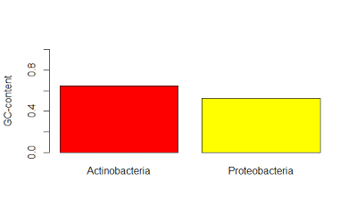

```
---[p.57]------------------------------------------------------------
Chap.3 Sequence Analysis with R

データベースから配列を取得するのに"SeqinR"ライブラリを使います。
詳しくはこちらを参照＞　http://seqinr.r-forge.r-project.org/

> install.packages("seqinr")
> 略
> 
> library(seqinr)
> 

> choosebank()　ネットワーク次第でうまくいかない場合有。数回トライ
 [1] "genbank"         "embl"            "emblwgs"         "swissprot"      
 [5] "ensembl"         "hogenom"         "hogenomdna"      "hovergendna"    
 [9] "hovergen"        "hogenom5"        "hogenom5dna"     "hogenom4"       
[13] "hogenom4dna"     "homolens"        "homolensdna"     "hobacnucl"      
[17] "hobacprot"       "phever2"         "phever2dna"      "refseq"         
[21] "greviews"        "bacterial"       "archaeal"        "protozoan"      
[25] "ensprotists"     "ensfungi"        "ensmetazoa"      "ensplants"      
[29] "ensemblbacteria" "mito"            "polymorphix"     "emglib"         
[33] "refseqViruses"   "taxodb"         


> ?choosebank
> 
> 
> choosebank("genbank")


> 
> t1 <- query("BRCA1","SP=Homo sapiens AND K=BRCA1")　注）本と異なる
> 
> 
> attributes(t1)
$names
[1] "call"     "name"     "nelem"    "typelist" "req"      "socket"  

$class
[1] "qaw"

> 
> summary(t1)
         Length Class    Mode     
call       3    -none-   call     
name       1    -none-   character
nelem      1    -none-   numeric  
typelist   1    -none-   character
req      158    -none-   list     
socket     1    sockconn numeric  
> 
> 
> t1$name
[1] "BRCA1"
> 
> t1$req
[[1]]
            name           length            frame           ncbicg 
"AB621825.BRCA1"             "71"              "0"              "1" 

[[2]]
            name           length            frame           ncbicg 
"AF005068.BRCA1"           "5379"              "0"              "1" 

＜中略＞

[[158]]
          name         length          frame         ncbicg 
"Y08757.BRCA1"           "88"            "0"            "1" 


> 
> t2<-query(listname="BRCA1", query="SP=Homo sapiens AND AC=U61268")
> 
> t2
1 SQ for SP=Homo sapiens AND AC=U61268
> 
> 
> summary(t2)
         Length Class    Mode     
call     3      -none-   call     
name     1      -none-   character
nelem    1      -none-   numeric  
typelist 1      -none-   character
req      1      -none-   list     
socket   1      sockconn numeric  
> 
> 


> 
> 
> t1_seq1 <- getSequence(t1$req[[1]])
> 
> t1_seq1
 [1] "a" "t" "g" "g" "a" "t" "t" "t" "a" "t" "c" "t" "g" "c" "t" "c" "t" "t"
[19] "c" "g" "c" "g" "t" "t" "g" "a" "a" "g" "a" "a" "g" "t" "a" "c" "a" "a"
[37] "a" "a" "t" "g" "t" "c" "a" "t" "t" "a" "a" "t" "g" "c" "t" "a" "t" "g"
[55] "c" "a" "g" "a" "a" "a" "a" "t" "c" "t" "t" "a" "g" "a" "g" "t" "g"
> 
> 

> t2_seq1 <- getSequence(t2$req[[1]])
> 
> 
> t2_seq1
   [1] "t" "c" "g" "c" "t" "a" "g" "a" "a" "c" "c" "c" "g" "g" "g" "a" "g" "g"
  [19] "c" "g" "g" "a" "g" "g" "t" "t" "g" "c" "a" "g" "t" "g" "a" "g" "c" "c"
　<中略>
[1315] "g" "a" "a" "a" "a" "c" "c" "c" "c" "c" "t" "c" "t" "c" "c" "a" "c" "t"
[1333] "a" "a" "a" "a" "a" "t"


> closebank()
> 


> t1_ann1 <- getAnnot(t1$req[[1]])  closebankすると使えない
Error in summary.connection(socket) : invalid connection
> 
> choosebank("genbank")　　再開
> 
> 
> t1_ann1 <- getAnnot(t1$req[[1]])　　注釈データをダウンロード可能に
> 
> t1_ann1
[1] "     CDS             648..>718"                                               
[2] "                     /gene=\"BRCA1\""                                         
[3] "                     /codon_start=1"                                          
[4] "                     /product=\"breast cancer type 1 susceptibility protein\""
[5] "                     /protein_id=\"BAK64160.1\""                              
[6] "                     /db_xref=\"GI:344179065\""                               
[7] "                     /translation=\"MDLSALRVEEVQNVINAMQKILE\""                
> 


--------------[p.63]-------------------------------------------------------------------------------------

FASTA形式ファイルの読込み

FASTA形式＝塩基配列・アミノ酸配列のファイル形式のスタンダード
https://en.wikipedia.org/wiki/FASTA_format
https://ja.wikipedia.org/wiki/FASTA

> mysequence <- read.fasta(file="myfasta.fasta")
> 
> mysequence
$`2BQ0:A|PDBID|CHAIN|SEQUENCE`
  [1] "m" "t" "m" "d" "k" "s" "e" "l" "v" "q" "k" "a"
 [13] "k" "l" "a" "e" "q" "a" "e" "r" "y" "d" "d" "m"
 [25] "a" "a" "a" "m" "k" "a" "v" "t" "e" "q" "g" "h"
 [37] "e" "l" "s" "n" "e" "e" "r" "n" "l" "l" "s" "v"
 [49] "a" "y" "k" "n" "v" "v" "g" "a" "r" "r" "s" "s"
 [61] "w" "r" "v" "i" "s" "s" "i" "e" "q" "k" "t" "e"
 [73] "r" "n" "e" "k" "k" "q" "q" "m" "g" "k" "e" "y"
 [85] "r" "e" "k" "i" "e" "a" "e" "l" "q" "d" "i" "c"
 [97] "n" "d" "v" "l" "e" "l" "l" "d" "k" "y" "l" "i"
[109] "p" "n" "a" "t" "q" "p" "e" "s" "k" "v" "f" "y"
[121] "l" "k" "m" "k" "g" "d" "y" "f" "r" "y" "l" "s"
[133] "e" "v" "a" "s" "g" "d" "n" "k" "q" "t" "t" "v"
[145] "s" "n" "q" "q" "a" "y" "q" "e" "a" "f" "e" "i"
[157] "s" "k" "k" "e" "m" "q" "p" "t" "h" "p" "i" "r"
[169] "l" "g" "l" "a" "l" "n" "f" "s" "v" "f" "y" "y"
[181] "e" "i" "l" "n" "s" "p" "e" "k" "a" "c" "s" "l"
[193] "a" "k" "t" "a" "f" "d" "e" "a" "i" "a" "e" "l"
[205] "d" "t" "l" "n" "e" "e" "s" "y" "k" "d" "s" "t"
[217] "l" "i" "m" "q" "l" "l" "r" "d" "n" "l" "t" "w"
[229] "t" "s" "e" "n" "q" "g" "d" "e" "g" "e" "n" "l"
[241] "y" "f" "q"
attr(,"name")
[1] "2BQ0:A|PDBID|CHAIN|SEQUENCE"
attr(,"Annot")
[1] ">2BQ0:A|PDBID|CHAIN|SEQUENCE"
attr(,"class")
[1] "SeqFastadna"

> 
> mynames <- getName(t1)
> 
> mynames
  [1] "AB621825.BRCA1" "AF005068.BRCA1"
  [3] "AF284812.BRCA1" "AF507076.BRCA1"
  [5] "AF507077.BRCA1" "AF507078.BRCA1"
  [7] "AY093484.BRCA1" "AY093485.BRCA1"
  [9] "AY093486.BRCA1" "AY093487.BRCA1"
 [11] "AY093489.BRCA1" "AY093490.BRCA1"
 [13] "AY093491.BRCA1" "AY093492.BRCA1"
 [15] "AY093493.BRCA1" "AY144588"      
 [17] "AY150865"       "AY273801.BRCA1"
 [19] "AY304547.BRCA1" "AY438030"      
 [21] "AY438031"       "AY706911"      
 [23] "AY706912.BRCA1" "AY706913"      
 [25] "AY751490"       "BC030969.BRCA1"
 [27] "BC062429"       "BC072418.BRCA1"
 [29] "BC085615.BRCA1" "BC106745.BRCA1"
 [31] "BC106746"       "BC115037.BRCA1"
 [33] "DQ075361"       "DQ116737"      
 [35] "DQ145822"       "DQ145823"      
 [37] "DQ145824"       "DQ145825.BRCA1"
 [39] "DQ145826"       "DQ190450.BRCA1"
 [41] "DQ190451.BRCA1" "DQ190452.BRCA1"
 [43] "DQ190453.BRCA1" "DQ190454.BRCA1"
 [45] "DQ190455.BRCA1" "DQ190456.BRCA1"
 [47] "DQ190457.BRCA1" "DQ299305"      
 [49] "DQ299306"       "DQ299307"      
 [51] "DQ299308"       "DQ299309"      
 [53] "DQ299310"       "DQ299311"      
 [55] "DQ299312"       "DQ299313"      
 [57] "DQ299314"       "DQ299315"      
 [59] "DQ299316"       "DQ299317"      
 [61] "DQ299318"       "DQ299319"      
 [63] "DQ299320"       "DQ299321"      
 [65] "DQ299322"       "DQ299323"      
 [67] "DQ299324"       "DQ299325"      
 [69] "DQ299326"       "DQ299327"      
 [71] "DQ299328"       "DQ299330"      
 [73] "DQ299331"       "DQ363751.BRCA1"
 [75] "DQ478408.BRCA1" "FJ940752.BRCA1"
 [77] "HE600032"       "HE600033.BRCA1"
 [79] "HE600034"       "HE600035"      
 [81] "HE600036"       "HE600037"      
 [83] "HE600038"       "HSU14680.BRCA1"
 [85] "HSU18009"       "HSU18018"      
 [87] "HSU37574.BRCA1" "HSU61268.BRCA1"
 [89] "HSU64805"       "HSU68041.BRCA1"
 [91] "JN384124.BRCA1" "JN686490"      
 [93] "JX480460.BRCA1" "JX480461"      
 [95] "JX480462.BRCA1" "JX480463.BRCA1"
 [97] "JX480464.BRCA1" "JX480465.BRCA1"
 [99] "JX480466.BRCA1" "JX480467"      
[101] "KJ625149.BRCA1" "KJ625150.BRCA1"
[103] "KJ625151.BRCA1" "KJ625152.BRCA1"
[105] "KJ625153.BRCA1" "KJ625154.BRCA1"
[107] "KJ625155.BRCA1" "KJ625156.BRCA1"
[109] "KJ625157.BRCA1" "KJ625158.BRCA1"
[111] "KJ625159.BRCA1" "KJ625160.BRCA1"
[113] "KJ625161.BRCA1" "KJ625162"      
[115] "KJ625163.BRCA1" "KJ625164.BRCA1"
[117] "KJ625165.BRCA1" "KJ625166.BRCA1"
[119] "KJ625167.BRCA1" "KJ625168.BRCA1"
[121] "KJ625169.BRCA1" "KJ625170.BRCA1"
[123] "KJ625171.BRCA1" "KJ625172.BRCA1"
[125] "KJ625173.BRCA1" "KJ625174.BRCA1"
[127] "KJ625175.BRCA1" "KJ625176.BRCA1"
[129] "KJ625176.PE2"   "KJ625177.BRCA1"
[131] "KJ625178.BRCA1" "KJ625179.BRCA1"
[133] "KM434065"       "KP255396.BRCA1"
[135] "KP255397.BRCA1" "KP255398.BRCA1"
[137] "KP255399.BRCA1" "KP255400.BRCA1"
[139] "KP255401.BRCA1" "KP255402.BRCA1"
[141] "KP255403.BRCA1" "KP272102.BRCA1"
[143] "KP272103.BRCA1" "KP272104.BRCA1"
[145] "KP272105.BRCA1" "KP272106.BRCA1"
[147] "KP404097"       "KP455327.BRCA1"
[149] "KP701015"       "KP701016.BRCA1"
[151] "KP729136"       "KP729137"      
[153] "KP744861"       "KP753383.BRCA1"
[155] "KT120061.BRCA1" "L78833.BRCA1"  
[157] "S78558.BRCA1"   "Y08757.BRCA1"  
> 
> length(t1)
[1] 6
> 
> length(mynames)
[1] 158
> 

> myseq.string <- getSequence(t1$req[1:4],as.string=TRUE)
> 
> myseq.string
[[1]]
[1] "atggatttatctgctcttcgcgttgaagaagtacaaaatgtcattaatgctatgcagaaaatcttagagtg"

[[2]]
[1] "atgagcctacaagaaagtacgagattcagtcaacttgttgaagagctattgaaaaccatttgtgcttttcagcttgacacaggtttggagtatgcaaacagctataattttgcaaaaaaggaaaataactctcctgaacatctaaaagatgaagtttctatcatccaaagtatgggctacagaaaccgtgccaaaagacttctacagagtgaacccgaaaatccttccttggaaaccagtctcagtgtccaactctctaaccttggaactgtgagaactctgaggacaaagcagcggatacaacctcaaaagacgtctgtctacattgaattgggatctgattcttctgaagataccgttaataaggcaacttattgcagtgtgggagatcaagaattgttacaaatcacccctcaaggaaccagggatgaaatcagtttggactctgcaaaaaaggctgcttgtgaattttctgagacggatgtaacaaatactgaacatcatcaacccagtaataatgatttgaacaccactgagaagcgtgcagctgagaggcatccagaaaagtatcagggtagttctgtttcaaacttgcatgtggagccatgtggcacaaatactcatgccagctcattacagcatgagaacagcagtttattactcactaaagacagaatgaatgtagaaaaggctgaattctgtaataaaagcaaacagcctggcttagcaaggagccaacataacagatgggctggaagtaaggaaacatgtaatgataggcggactcccagcacagaaaaaaaggtagatctgaatgctgatcccctgtgtgagagaaaagaatggaataagcagaaactgccatgctcagagaatcctagagatactgaagatgttccttggataacactaaatagcagcattcagaaagttaatgagtggttttccagaagtgatgaactgttaggttctgatgactcacatgatggggagtctgaatcaaatgccaaagtagctgatgtattggacgttctaaatgaggtagatgaatattctggttcttcagagaaaatagacttactggccagtgatcctcatgaggctttaatatgtaaaagtgaaagagttcactccaaatcagtagagagtaatattgaagacaaaatatttgggaaaacctatcggaagaaggcaagcctccccaacttaagccatgtaactgaaaatctaattataggagcatttgttactgagccacagataatacaagagcgtcccctcacaaataaattaaagcgtaaaaggagacctacatcaggccttcatcctgaggattttatcaagaaagcagatttggcagttcaaaagactcctgaaatgataaatcagggaactaaccaaacggagcagaatggtcaagtgatgaatattactaatagtggtcatgagaataaaacaaaaggtgattctattcagaatgagaaaaatcctaacccaatagaatcactcgaaaaagaatctgctttcaaaacgaaagctgaacctataagcagcagtataagcaatatggaactcgaattaaatatccacaattcaaaagcacctaaaaagaataggctgaggaggaagtcttctaccaggcatattcatgcgcttgaactagtagtcagtagaaatctaagcccacctaattgtactgaattgcaaattgatagttgttctagcagtgaagagataaagaaaaaaaagtacaaccaaatgccagtcaggcacagcagaaacctacaactcatggaaggtaaagaacctgcaactggagccaagaagagtaacaagccaaatgaacagacaagtaaaagacatgacagcgatactttcccagagctgaagttaacaaatgcacctggttcttttactaagtgttcaaataccagtgaacttaaagaatttgtcaatcctagccttccaagagaagaaaaagaagagaaactagaaacagttaaagtgtctaataatgctgaagaccccaaagatctcatgttaagtggagaaagggttttgcaaactgaaagatctgtagagagtagcagtatttcattggtacctggtactgattatggcactcaggaaagtatctcgttactggaagttagcactctagggaaggcaaaaacagaaccaaataaatgtgtgagtcagtgtgcagcatttgaaaaccccaagggactaattcatggttgttccaaagataatagaaatgacacagaaggctttaagtatccattgggacatgaagttaaccacagtcgggaaacaagcatagaaatggaagaaagtgaacttgatgctcagtatttgcagaatacattcaaggtttcaaagcgccagtcatttgctccgttttcaaatccaggaaatgcagaagaggaatgtgcaacattctctgcccactctgggtccttaaagaaacaaagtccaaaagtcacttttgaatgtgaacaaaaggaagaaaatcaaggaaagaatgagtctaatatcaagcctgtacagacagttaatatcactgcaggctttcctgtggttggtcagaaagataagccagttgataatgccaaatgtagtatcaaaggaggctctaggttttgtctatcatctcagttcagaggcaacgaaactggactcattactccaaataaacatggacttttacaaaacccatatcgtataccaccactttttcccatcaagtcatttgttaaaactaaatgtaagaaaaatctgctagaggaaaactttgaggaacattcaatgtcacctgaaagagaaatgggaaatgagaacattccaagtacagtgagcacaattagccgtaataacattagagaaaatgtttttaaagaagccagctcaagcaatattaatgaagtaggttccagtactaatgaagtgggctccagtattaatgaaataggttccagtgatgaaaacattcaagcagaactaggtagaaacagaaggcccaaattgaatgctatgcttagattaggggttttgcaacctgaggtctataaacaaagtcttcctggaagtaattgtaagcatcctgaaataaaaaagcaagaatatgaagaagtagttcagactgttaatacagatttctctccatatctgatttcagataacttagaacagcctatgggaagtagtcatgcatctcaggtttgttctgagacacctgatgacctgttagatgatggtgaaataaaggaagatactagttttgctgaaaatgacattaaggaaagttctgctgtttttagcaaaagcgtccagaaaggagagcttagcaggagtcctagccctttcacccatacacatttggctcagggttaccgaagaggggccaagaaattagagtcctcagaagagaacttatctagtgaggatgaagagcttccctgcttccaacacttgttatttggtaaagtaaacaatataccttctcagtctactaggcatagcaccgttgctaccgagtgtctgtctaagaacacagaggagaatttattatcattgaagaatagcttaaatgactgcagtaaccaggtaatattggcaaaggcatctcaggaacatcaccttagtgaggaaacaaaatgttctgctagcttgttttcttcacagtgcagtgaattggaagacttgactgcaaatacaaacacccaggatcctttcttgattggttcttccaaacaaatgaggcatcagtctgaaagccagggagttggtctgagtgacaaggaattggtttcagatgatgaagaaagaggaacgggcttggaagaaaataatcaagaagagcaaagcatggattcaaacttaggtgaagcagcatctgggtgtgagagtgaaacaagcgtctctgaagactgctcagggctatcctctcagagtgacattttaaccactcagcagagggataccatgcaacataacctgataaagctccagcaggaaatggctgaactagaagctgtgttagaacagcatgggagccagccttctaacagctacccttccatcataagtgactcttctgcccttgaggacctgcgaaatccagaacaaagcacatcagaaaaagcagtattaacttcacagaaaagtagtgaataccctataagccagaatccagaaggcctttctgctgacaagtttgaggtgtctgcagatagttctaccagtaaaaataaagaaccaggagtggaaaggtcatccccttctaaatgcccatcattagatgataggtggtacatgcacagttgctctgggagtcttcagaatagaaactacccatctcaagaggagctcattaaggttgttgatgtggaggagcaacagctggaagagtctgggccacacgatttgacggaaacatcttacttgccaaggcaagatctagagggaaccccttacctggaatctggaatcagcctcttctctgatgaccctgaatctgatccttctgaagacagagccccagagtcagctcgtgttggcaacataccatcttcaacctctgcattgaaagttccccaattgaaagttgcagaatctgcccagagtccagctgctgctcatactactgatactgctgggtataatgcaatggaagaaagtgtgagcagggagaagccagaattgacagcttcaacagaaagggtcaacaaaagaatgtccatggtggtgtctggcctgaccccagaagaatttatgctcgtgtacaagtttgccagaaaacaccacatcactttaactaatctaattactgaagagactactcatgttgttatgaaaacagatgctgagtttgtgtgtgaacggacactgaaatattttctaggaattgcgggaggaaaatgggtagttagctatttctgggtgacccagtctattaaagaaagaaaaatgctgaatgagcatgattttgaagtcagaggagatgtggtcaatggaagaaaccaccaaggtccaaagcgagcaagagaatcccaggacagaaagatcttcagggggctagaaatctgttgctatgggcccttcaccaacatgcccacagatcaactggaatggatggtacagctgtgtggtgcttctgtggtgaaggagctttcatcattcacccttggcacaggtgtccacccaattgtggttgtgcagccagatgcctggacagaggacaatggcttccatgcaattgggcagatgtgtgaggcacctgtggtgacccgagagtgggtgttggacagtgtagcactctaccagtgccaggagctggacacctacctgataccccagatcccccacagccactactga"

[[3]]
[1] "catgattttgaagtcagaggagatgtggtcaatggaagaaaccaccaaggtccaaagcgagcaagagaatcccaggacagaaag"

[[4]]
[1] "catgattttgaagtcagaggagatgtggtcaatggaagaaaccaccaaggtccaaagcgagcaagagaatcccaggacagaaag"

> mynames<-getName(t1$req[1:4]) >  > write.fasta(myseq.string,mynames,file.out="myBRCA1to4.fa")


■myBRCA1to4.faの中身は次の通りです

>AB621825.BRCA1
atggatttatctgctcttcgcgttgaagaagtacaaaatgtcattaatgctatgcagaaaatcttagagtg
>AF005068.BRCA1
atgagcctacaagaaagtacgagattcagtcaacttgttgaagagctattgaaaaccatttgtgcttttcagcttgacacaggtttggagtatgcaaacagctataattttgcaaaaaaggaaaataactctcctgaacatctaaaagatgaagtttctatcatccaaagtatgggctacagaaaccgtgccaaaagacttctacagagtgaacccgaaaatccttccttggaaaccagtctcagtgtccaactctctaaccttggaactgtgagaactctgaggacaaagcagcggatacaacctcaaaagacgtctgtctacattgaattgggatctgattcttctgaagataccgttaataaggcaacttattgcagtgtgggagatcaagaattgttacaaatcacccctcaaggaaccagggatgaaatcagtttggactctgcaaaaaaggctgcttgtgaattttctgagacggatgtaacaaatactgaacatcatcaacccagtaataatgatttgaacaccactgagaagcgtgcagctgagaggcatccagaaaagtatcagggtagttctgtttcaaacttgcatgtggagccatgtggcacaaatactcatgccagctcattacagcatgagaacagcagtttattactcactaaagacagaatgaatgtagaaaaggctgaattctgtaataaaagcaaacagcctggcttagcaaggagccaacataacagatgggctggaagtaaggaaacatgtaatgataggcggactcccagcacagaaaaaaaggtagatctgaatgctgatcccctgtgtgagagaaaagaatggaataagcagaaactgccatgctcagagaatcctagagatactgaagatgttccttggataacactaaatagcagcattcagaaagttaatgagtggttttccagaagtgatgaactgttaggttctgatgactcacatgatggggagtctgaatcaaatgccaaagtagctgatgtattggacgttctaaatgaggtagatgaatattctggttcttcagagaaaatagacttactggccagtgatcctcatgaggctttaatatgtaaaagtgaaagagttcactccaaatcagtagagagtaatattgaagacaaaatatttgggaaaacctatcggaagaaggcaagcctccccaacttaagccatgtaactgaaaatctaattataggagcatttgttactgagccacagataatacaagagcgtcccctcacaaataaattaaagcgtaaaaggagacctacatcaggccttcatcctgaggattttatcaagaaagcagatttggcagttcaaaagactcctgaaatgataaatcagggaactaaccaaacggagcagaatggtcaagtgatgaatattactaatagtggtcatgagaataaaacaaaaggtgattctattcagaatgagaaaaatcctaacccaatagaatcactcgaaaaagaatctgctttcaaaacgaaagctgaacctataagcagcagtataagcaatatggaactcgaattaaatatccacaattcaaaagcacctaaaaagaataggctgaggaggaagtcttctaccaggcatattcatgcgcttgaactagtagtcagtagaaatctaagcccacctaattgtactgaattgcaaattgatagttgttctagcagtgaagagataaagaaaaaaaagtacaaccaaatgccagtcaggcacagcagaaacctacaactcatggaaggtaaagaacctgcaactggagccaagaagagtaacaagccaaatgaacagacaagtaaaagacatgacagcgatactttcccagagctgaagttaacaaatgcacctggttcttttactaagtgttcaaataccagtgaacttaaagaatttgtcaatcctagccttccaagagaagaaaaagaagagaaactagaaacagttaaagtgtctaataatgctgaagaccccaaagatctcatgttaagtggagaaagggttttgcaaactgaaagatctgtagagagtagcagtatttcattggtacctggtactgattatggcactcaggaaagtatctcgttactggaagttagcactctagggaaggcaaaaacagaaccaaataaatgtgtgagtcagtgtgcagcatttgaaaaccccaagggactaattcatggttgttccaaagataatagaaatgacacagaaggctttaagtatccattgggacatgaagttaaccacagtcgggaaacaagcatagaaatggaagaaagtgaacttgatgctcagtatttgcagaatacattcaaggtttcaaagcgccagtcatttgctccgttttcaaatccaggaaatgcagaagaggaatgtgcaacattctctgcccactctgggtccttaaagaaacaaagtccaaaagtcacttttgaatgtgaacaaaaggaagaaaatcaaggaaagaatgagtctaatatcaagcctgtacagacagttaatatcactgcaggctttcctgtggttggtcagaaagataagccagttgataatgccaaatgtagtatcaaaggaggctctaggttttgtctatcatctcagttcagaggcaacgaaactggactcattactccaaataaacatggacttttacaaaacccatatcgtataccaccactttttcccatcaagtcatttgttaaaactaaatgtaagaaaaatctgctagaggaaaactttgaggaacattcaatgtcacctgaaagagaaatgggaaatgagaacattccaagtacagtgagcacaattagccgtaataacattagagaaaatgtttttaaagaagccagctcaagcaatattaatgaagtaggttccagtactaatgaagtgggctccagtattaatgaaataggttccagtgatgaaaacattcaagcagaactaggtagaaacagaaggcccaaattgaatgctatgcttagattaggggttttgcaacctgaggtctataaacaaagtcttcctggaagtaattgtaagcatcctgaaataaaaaagcaagaatatgaagaagtagttcagactgttaatacagatttctctccatatctgatttcagataacttagaacagcctatgggaagtagtcatgcatctcaggtttgttctgagacacctgatgacctgttagatgatggtgaaataaaggaagatactagttttgctgaaaatgacattaaggaaagttctgctgtttttagcaaaagcgtccagaaaggagagcttagcaggagtcctagccctttcacccatacacatttggctcagggttaccgaagaggggccaagaaattagagtcctcagaagagaacttatctagtgaggatgaagagcttccctgcttccaacacttgttatttggtaaagtaaacaatataccttctcagtctactaggcatagcaccgttgctaccgagtgtctgtctaagaacacagaggagaatttattatcattgaagaatagcttaaatgactgcagtaaccaggtaatattggcaaaggcatctcaggaacatcaccttagtgaggaaacaaaatgttctgctagcttgttttcttcacagtgcagtgaattggaagacttgactgcaaatacaaacacccaggatcctttcttgattggttcttccaaacaaatgaggcatcagtctgaaagccagggagttggtctgagtgacaaggaattggtttcagatgatgaagaaagaggaacgggcttggaagaaaataatcaagaagagcaaagcatggattcaaacttaggtgaagcagcatctgggtgtgagagtgaaacaagcgtctctgaagactgctcagggctatcctctcagagtgacattttaaccactcagcagagggataccatgcaacataacctgataaagctccagcaggaaatggctgaactagaagctgtgttagaacagcatgggagccagccttctaacagctacccttccatcataagtgactcttctgcccttgaggacctgcgaaatccagaacaaagcacatcagaaaaagcagtattaacttcacagaaaagtagtgaataccctataagccagaatccagaaggcctttctgctgacaagtttgaggtgtctgcagatagttctaccagtaaaaataaagaaccaggagtggaaaggtcatccccttctaaatgcccatcattagatgataggtggtacatgcacagttgctctgggagtcttcagaatagaaactacccatctcaagaggagctcattaaggttgttgatgtggaggagcaacagctggaagagtctgggccacacgatttgacggaaacatcttacttgccaaggcaagatctagagggaaccccttacctggaatctggaatcagcctcttctctgatgaccctgaatctgatccttctgaagacagagccccagagtcagctcgtgttggcaacataccatcttcaacctctgcattgaaagttccccaattgaaagttgcagaatctgcccagagtccagctgctgctcatactactgatactgctgggtataatgcaatggaagaaagtgtgagcagggagaagccagaattgacagcttcaacagaaagggtcaacaaaagaatgtccatggtggtgtctggcctgaccccagaagaatttatgctcgtgtacaagtttgccagaaaacaccacatcactttaactaatctaattactgaagagactactcatgttgttatgaaaacagatgctgagtttgtgtgtgaacggacactgaaatattttctaggaattgcgggaggaaaatgggtagttagctatttctgggtgacccagtctattaaagaaagaaaaatgctgaatgagcatgattttgaagtcagaggagatgtggtcaatggaagaaaccaccaaggtccaaagcgagcaagagaatcccaggacagaaagatcttcagggggctagaaatctgttgctatgggcccttcaccaacatgcccacagatcaactggaatggatggtacagctgtgtggtgcttctgtggtgaaggagctttcatcattcacccttggcacaggtgtccacccaattgtggttgtgcagccagatgcctggacagaggacaatggcttccatgcaattgggcagatgtgtgaggcacctgtggtgacccgagagtgggtgttggacagtgtagcactctaccagtgccaggagctggacacctacctgataccccagatcccccacagccactactga
>AF284812.BRCA1
catgattttgaagtcagaggagatgtggtcaatggaagaaaccaccaaggtccaaagcgagcaagagaatcccaggacagaaag
>AF507076.BRCA1
catgattttgaagtcagaggagatgtggtcaatggaagaaaccaccaaggtccaaagcgagcaagagaatcccaggacagaaag


-------------[p.65]---------------------------------------------------------------------------------------

> library(seqinr)
> 
> choosebank("genbank")
> 
> 
> a1<-query(listname="actino", query="SP=Mycobacterium tuberculosis AND K=rpoB")
Warning message:
closing unused connection 4 (->pbil.univ-lyon1.fr:5558) 
> 
> 
> a1<-query("actino", "SP=Mycobacterium tuberculosis AND K=rpoB")
> 
> p1<-query("proteo", "SP=Escherichia coli AND K=rpoB")
> 
> summary(a1$req)
       Length Class       Mode     
  [1,] 1      SeqAcnucWeb character
  [2,] 1      SeqAcnucWeb character
  [3,] 1      SeqAcnucWeb character
  [4,] 1      SeqAcnucWeb character
  [5,] 1      SeqAcnucWeb character
  [6,] 1      SeqAcnucWeb character
  [7,] 1      SeqAcnucWeb character
  [8,] 1      SeqAcnuc
 ＜中略＞
[792,] 1      SeqAcnucWeb character
[793,] 1      SeqAcnucWeb character
[794,] 1      SeqAcnucWeb character
> summary(p1$req)
       Length Class       Mode     
  [1,] 1      SeqAcnucWeb character
  [2,] 1      SeqAcnucWeb character
  [3,] 1      SeqAcnucWeb character
  [4,] 1      SeqAcnucWeb character
  [5,] 1      SeqAcnucWeb character
  [6,] 1      SeqAcnucWeb character
  [7,] 1      SeqAcnucWeb character
  [8,] 1      SeqAcnucWeb character
  ＜中略＞
[251,] 1      SeqAcnucWeb character
[252,] 1      SeqAcnucWeb character

> a1_seq644 <- getSequence(a1$req[[644]])
> 

> p1_seq1 <- getSequence(p1$req[[1]])
> 


> 
> table(a1_seq644)　
a1_seq644
   a    c    g    t 
 678 1086 1191  582 
> 
> 
> table(p1_seq1)
p1_seq1
   a    c    g    t    y 
1013 1026 1090  899    1 

----------------------------------------
＜宿題＞
次の塩基パターンの定義について調べてください。
r, y, w, s, k, m, d, h, n
(ex. y= C / T)
-----------------------------------------

> 
> table(p1_seq1)/length(p1_seq1)
p1_seq1
           a            c            g            t            y 
0.2514271531 0.2546537602 0.2705385952 0.2231322909 0.0002482005 
> 
> 

> 

> table(mysequence)　アミノ酸配列のケース
mysequence
 a  c  d  e  f  g  h  i  k  l  m  n  p  q  r  s  t  v 
20  2 13 29  7  8  2 10 20 24  8 14  5 16 10 18 12 11 
 w  y 
 2 12 
> 


-------------[p.67 10以降、GC含量の計算]-------------------------------------------------------------


> GC(a1_seq644)
[1] 0.6437659
> 
> GC(p1_seq1)
[1] 0.5253227
> 
> 
> 
> barplot(c(Actinobacteria=GC(a1_seq644),Proteobacteria=GC(p1_seq1)),col=heat.colors(2),ylim=c(0,1.0),ylab="GC-content")
> 
```



```
> 
>
> seqinr::count(a1_seq644,wordsize=2)

 aa  ac  ag  at  ca  cc  cg  ct  ga  gc  gg  gt  ta  tc  tg  tt 
131 232 194 120 218 289 433 146 290 340 326 235  39 225 237  81 


> seqinr::count(a1_seq644,wordsize=1)

   a    c    g    t 
 678 1086 1191  582 


> seqinr::count(a1_seq644,wordsize=3)

aaa aac aag aat aca acc acg act aga agc agg agt ata 
 18  47  56   9  46  77  86  23  43  55  71  25   3 
atc atg att caa cac cag cat cca ccc ccg cct cga cgc 
 65  40  12  70  59  41  48  61  60 135  33 133 111 
cgg cgt cta ctc ctg ctt gaa gac gag gat gca gcc gcg 
119  70  16  31  79  20  38 101  93  58  62 102 108 
gct gga ggc ggg ggt gta gtc gtg gtt taa tac tag tat 
 68  65 102  64  95  18  85  92  40   5  25   4   5 
tca tcc tcg tct tga tgc tgg tgt tta ttc ttg ttt 
 49  50 104  22  49  72  72  44   2  44  26   9 


------------------------
> GC(p1_seq1)
[1] 0.5253227
> 
> p1_tab<-table(p1_seq1)
> p1_tab
p1_seq1
   a    c    g    t    y 
1013 1026 1090  899    1 
> 
> myGC <- sum(p1_tab[2],p1_tab[3])/sum(p1_tab)
> 
> myGC
[1] 0.5251924
> 
> myGC_pct <- myGC*100
> 
> myGC_pct
[1] 52.51924
> 

```
