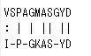
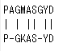

```
---[p.69]------------------

Pairwise sequence alignment
```

| Type | Algorithm | Sequence1='VSPAGMASGYD'　Sequence2='IPGKASYD'  |
|:-----------------|:-------------------------------|:-------------|
| Global alignment |  Needleman-Wunsch algorithm(*) |         |
|  Local alignment |  Smith-Waterman algorithm(*)   |       |


```
(*)動的計画法を使って配列アライメントを行っている
参考資料
https://www.ibm.com/developerworks/jp/java/library/j-seqalign/
http://www.jst.go.jp/nbdc/bird/jinzai/literacy/streaming/h21_3_1.pdf
http://demonstrations.wolfram.com/GlobalAndLocalSequenceAlignmentAlgorithms/
----------global alignment実行-------------------------

> source("http://Bioconductor.org/biocLite.R")
Bioconductor version 3.1 (BiocInstaller 1.18.5), ?biocLite for help
A newer version of Bioconductor is available for this version of R, ?BiocUpgrade
  for help
> biocLite("Biostrings")
BioC_mirror: http://bioconductor.org
Using Bioconductor version 3.1 (BiocInstaller 1.18.5), R version 3.2.2.

略
> library(Biostrings)
 要求されたパッケージ BiocGenerics をロード中です 
 要求されたパッケージ parallel をロード中です 

略

 要求されたパッケージ XVector をロード中です 
> 
> 
> s1<-"GAATTCGGCTA"
> s2<-"GATTACCTA"
> 
> score1<-nucleotideSubstitutionMatrix(match=1,mismatch=-1,baseOnly=TRUE)
> 
> 
> score1

   A  C  G  T
A  1 -1 -1 -1
C -1  1 -1 -1
G -1 -1  1 -1
T -1 -1 -1  1
> 
> gapOpen<- 2
> gapExtend<- 1
> 
> a1<-pairwiseAlignment(s1,s2,substitutionMatrix=score1,gapOpening=gapOpen,gapExtension=gapExtend,type="global",scoreOnly=FALSE)
> 
> 
> a1
Global PairwiseAlignmentsSingleSubject (1 of 1)
pattern: [1] GAATTCGGCTA 
subject: [1] GATTAC--CTA 
score: 1 
> 
> 
> data(package="Biostrings")
> 
> 
----別windowで表示---------------

Data sets in package eBiostringsf:

BLOSUM100               Scoring matrices
BLOSUM45                Scoring matrices
BLOSUM50                Scoring matrices
BLOSUM62                Scoring matrices
BLOSUM80                Scoring matrices
HNF4alpha               Known HNF4alpha binding sequences
PAM120                  Scoring matrices
PAM250                  Scoring matrices
PAM30                   Scoring matrices
PAM40                   Scoring matrices
PAM70                   Scoring matrices
phiX174Phage            Versions of bacteriophage phiX174 complete
                        genome and sample short reads
quPhiX174 (srPhiX174)   Versions of bacteriophage phiX174 complete
                        genome and sample short reads
srPhiX174               Versions of bacteriophage phiX174 complete
                        genome and sample short reads
wtPhiX174 (srPhiX174)   Versions of bacteriophage phiX174 complete
                        genome and sample short reads
yeastSEQCHR1            An annotation data file for CHR1 in the yeastSEQ
                        package
-----protein sequence-------------------------

> data(BLOSUM62)
> 
> subMat<-"BLOSUM62"
> 
> sp1<-"PAWHEAE"
> sp2<-"HEAGAWGHE"
> 
> a2<-pairwiseAlignment(sp1,sp2,substitutionMatrix=subMat,gapOpening=gapOpen,gapExtension=gapExtend,type="global",scoreOnly=FALSE)
> 
> a2
Global PairwiseAlignmentsSingleSubject (1 of 1)
pattern: [1] P---AW-HE 
subject: [1] HEAGAWGHE 
score: 14 

---showでも確認可能--------------


> show(a1)
Global PairwiseAlignmentsSingleSubject (1 of 1)
pattern: [1] GAATTCGGCTA 
subject: [1] GATTAC--CTA 
score: 1 
> 
> 
> 
> show(a2)
Global PairwiseAlignmentsSingleSubject (1 of 1)
pattern: [1] P---AW-HE 
subject: [1] HEAGAWGHE 
score: 14 
> 

----------local alignment実行-------------------------


> 
> a2_local<-pairwiseAlignment(sp1,sp2,substitutionMatrix=subMat,gapOpening=gapOpen,gapExtension=gapExtend,type="local",scoreOnly=FALSE)
> 
> 
> a2_local
Local PairwiseAlignmentsSingleSubject (1 of 1)
pattern: [2] AW-HE 
subject: [5] AWGHE 
score: 25 
> 

---------dot plot-----------------------------

注：HumanChimp.fastaをダウンロードしてください

> mseq<-read.fasta(file="HumanChimp.fasta")
> 
> mseq
$`sp|P68871|HBB_HUMAN`
  [1] "m" "v" "h" "l" "t" "p" "e" "e" "k" "s" "a" "v" "t" "a" "l" "w" "g"
 [18] "k" "v" "n" "v" "d" "e" "v" "g" "g" "e" "a" "l" "g" "r" "l" "l" "v"
 [35] "v" "y" "p" "w" "t" "q" "r" "f" "f" "e" "s" "f" "g" "d" "l" "s" "t"
 [52] "p" "d" "a" "v" "m" "g" "n" "p" "k" "v" "k" "a" "h" "g" "k" "k" "v"
 [69] "l" "g" "a" "f" "s" "d" "g" "l" "a" "h" "l" "d" "n" "l" "k" "g" "t"
 [86] "f" "a" "t" "l" "s" "e" "l" "h" "c" "d" "k" "l" "h" "v" "d" "p" "e"
[103] "n" "f" "r" "l" "l" "g" "n" "v" "l" "v" "c" "v" "l" "a" "h" "h" "f"
[120] "g" "k" "e" "f" "t" "p" "p" "v" "q" "a" "a" "y" "q" "k" "v" "v" "a"
[137] "g" "v" "a" "n" "a" "l" "a" "h" "k" "y" "h"
attr(,"name")
[1] "sp|P68871|HBB_HUMAN"
attr(,"Annot")
[1] ">sp|P68871|HBB_HUMAN"
attr(,"class")
[1] "SeqFastadna"

$`sp|P68873|HBB_PANTR`
  [1] "m" "v" "h" "l" "t" "p" "e" "e" "k" "s" "a" "v" "t" "a" "l" "w" "g"
 [18] "k" "v" "n" "v" "d" "e" "v" "g" "g" "e" "a" "l" "g" "r" "l" "l" "v"
 [35] "v" "y" "p" "w" "t" "q" "r" "f" "f" "e" "s" "f" "g" "d" "l" "s" "t"
 [52] "p" "d" "a" "v" "m" "g" "n" "p" "k" "v" "k" "a" "h" "g" "k" "k" "v"
 [69] "l" "g" "a" "f" "s" "d" "g" "l" "a" "h" "l" "d" "n" "l" "k" "g" "t"
 [86] "f" "a" "t" "l" "s" "e" "l" "h" "c" "d" "k" "l" "h" "v" "d" "p" "e"
[103] "n" "f" "r" "l" "l" "g" "n" "v" "l" "v" "c" "v" "l" "a" "h" "h" "f"
[120] "g" "k" "e" "f" "t" "p" "p" "v" "q" "a" "a" "y" "q" "k" "v" "v" "a"
[137] "g" "v" "a" "n" "a" "l" "a" "h" "k" "y" "h"
attr(,"name")
[1] "sp|P68873|HBB_PANTR"
attr(,"Annot")
[1] ">sp|P68873|HBB_PANTR"
attr(,"class")
[1] "SeqFastadna"

$`sp|P02112|HBB_CHICK`
  [1] "m" "v" "h" "w" "t" "a" "e" "e" "k" "q" "l" "i" "t" "g" "l" "w" "g"
 [18] "k" "v" "n" "v" "a" "e" "c" "g" "a" "e" "a" "l" "a" "r" "l" "l" "i"
 [35] "v" "y" "p" "w" "t" "q" "r" "f" "f" "a" "s" "f" "g" "n" "l" "s" "s"
 [52] "p" "t" "a" "i" "l" "g" "n" "p" "m" "v" "r" "a" "h" "g" "k" "k" "v"
 [69] "l" "t" "s" "f" "g" "d" "a" "v" "k" "n" "l" "d" "n" "i" "k" "n" "t"
 [86] "f" "s" "q" "l" "s" "e" "l" "h" "c" "d" "k" "l" "h" "v" "d" "p" "e"
[103] "n" "f" "r" "l" "l" "g" "d" "i" "l" "i" "i" "v" "l" "a" "a" "h" "f"
[120] "s" "k" "d" "f" "t" "p" "e" "c" "q" "a" "a" "w" "q" "k" "l" "v" "r"
[137] "v" "v" "a" "h" "a" "l" "a" "r" "k" "y" "h"
attr(,"name")
[1] "sp|P02112|HBB_CHICK"
attr(,"Annot")
[1] ">sp|P02112|HBB_CHICK"
attr(,"class")
[1] "SeqFastadna"

$`sp|Q90486|HBB1_DANRE`
  [1] "m" "v" "e" "w" "t" "d" "a" "e" "r" "t" "a" "i" "l" "g" "l" "w" "g"
 [18] "k" "l" "n" "i" "d" "e" "i" "g" "p" "q" "a" "l" "s" "r" "c" "l" "i"
 [35] "v" "y" "p" "w" "t" "q" "r" "y" "f" "a" "t" "f" "g" "n" "l" "s" "s"
 [52] "p" "a" "a" "i" "m" "g" "n" "p" "k" "v" "a" "a" "h" "g" "r" "t" "v"
 [69] "m" "g" "g" "l" "e" "r" "a" "i" "k" "n" "m" "d" "n" "v" "k" "n" "t"
 [86] "y" "a" "a" "l" "s" "v" "m" "h" "s" "e" "k" "l" "h" "v" "d" "p" "d"
[103] "n" "f" "r" "l" "l" "a" "d" "c" "i" "t" "v" "c" "a" "a" "m" "k" "f"
[120] "g" "q" "a" "g" "f" "n" "a" "d" "v" "q" "e" "a" "w" "q" "k" "f" "l"
[137] "a" "v" "v" "v" "s" "a" "l" "c" "r" "q" "y" "h"
attr(,"name")
[1] "sp|Q90486|HBB1_DANRE"
attr(,"Annot")
[1] ">sp|Q90486|HBB1_DANRE"
attr(,"class")
[1] "SeqFastadna"

$`sp|P02062|HBB_HORSE`
  [1] "v" "q" "l" "s" "g" "e" "e" "k" "a" "a" "v" "l" "a" "l" "w" "d" "k"
 [18] "v" "n" "e" "e" "e" "v" "g" "g" "e" "a" "l" "g" "r" "l" "l" "v" "v"
 [35] "y" "p" "w" "t" "q" "r" "f" "f" "d" "s" "f" "g" "d" "l" "s" "n" "p"
 [52] "g" "a" "v" "m" "g" "n" "p" "k" "v" "k" "a" "h" "g" "k" "k" "v" "l"
 [69] "h" "s" "f" "g" "e" "g" "v" "h" "h" "l" "d" "n" "l" "k" "g" "t" "f"
 [86] "a" "a" "l" "s" "e" "l" "h" "c" "d" "k" "l" "h" "v" "d" "p" "e" "n"
[103] "f" "r" "l" "l" "g" "n" "v" "l" "v" "v" "v" "l" "a" "r" "h" "f" "g"
[120] "k" "d" "f" "t" "p" "e" "l" "q" "a" "s" "y" "q" "k" "v" "v" "a" "g"
[137] "v" "a" "n" "a" "l" "a" "h" "k" "y" "h"
attr(,"name")
[1] "sp|P02062|HBB_HORSE"
attr(,"Annot")
[1] ">sp|P02062|HBB_HORSE"
attr(,"class")
[1] "SeqFastadna"

> dotPlot(mseq[[1]],mseq[[2]],col=c("gray","red"),xlab="Human",ylab="Chimp")


---[p.75]------------------------------------------------------------------------------------------

Multiple sequence alignment

注：fastaMSA.fastaをダウンロードしてください


> install.packages("muscle")
Installing package into ‘C:/Users/ekaminuma/Documents/R/win-library/3.2’
(as ‘lib’ is unspecified)
Warning in install.packages :
  package ‘muscle’ is not available (for R version 3.2.2)

> library(muscle)


> msa<-read.fasta(file="fastaMSA.fasta")
> 
> msa
$`sp|P00403|COX2_HUMAN`
 略
attr(,"name")
[1] "sp|P00403|COX2_HUMAN"
attr(,"Annot")
[1] ">sp|P00403|COX2_HUMAN"
attr(,"class")
[1] "SeqFastadna"

$`sp|P68530|COX2_BOVIN`
略　attr(,"name")
[1] "sp|P68530|COX2_BOVIN"
attr(,"Annot")
[1] ">sp|P68530|COX2_BOVIN"
attr(,"class")
[1] "SeqFastadna"

$`sp|P00406|COX2_RAT`
略
attr(,"name")
[1] "sp|P00406|COX2_RAT"
attr(,"Annot")
[1] ">sp|P00406|COX2_RAT"
attr(,"class")
[1] "SeqFastadna"

$`sp|P24894|COX2_CAEEL`
  [1] "m" "n" "n" "f" "f" "q" "g" "y" "n" "l" "l" "f" "q" "h"
略
[225] "w" "c" "f" "g" "t" "m" "e"
attr(,"name")
[1] "sp|P24894|COX2_CAEEL"
attr(,"Annot")
[1] ">sp|P24894|COX2_CAEEL"
attr(,"class")
[1] "SeqFastadna"

$`sp|P48660|COX2_HORSE`
略
attr(,"name")
[1] "sp|P48660|COX2_HORSE"
attr(,"Annot")
[1] ">sp|P48660|COX2_HORSE"
attr(,"class")
[1] "SeqFastadna"

$`sp|Q38PR9|COX2_MAMPR`
  [1] "m" "a" "y" "p" "l" "q" "l" "g" "f" "q" "d" "a" "t" "s"
略
[225] "s" "l" "a"
attr(,"name")
[1] "sp|Q38PR9|COX2_MAMPR"
attr(,"Annot")
[1] ">sp|Q38PR9|COX2_MAMPR"
attr(,"class")
[1] "SeqFastadna"

$`sp|Q9TA26|COX2_LOXAF`
  [1] "m" "a" "y" "p" "l" "q" "l" "g" "f" "q" "d" "a" "t" "s"
略
[225] "s" "l" "a" "q"
attr(,"name")
[1] "sp|Q9TA26|COX2_LOXAF"
attr(,"Annot")
[1] ">sp|Q9TA26|COX2_LOXAF"
attr(,"class")
[1] "SeqFastadna"

$`sp|P26456|COX2_GORGO`
  [1] "m" "a" "h" "a" "a" "q" "v" "g" "l" "q" "d" "a" "t" "s"
略
[225] "f" "a" "l"
attr(,"name")
[1] "sp|P26456|COX2_GORGO"
attr(,"Annot")
[1] ">sp|P26456|COX2_GORGO"
attr(,"class")
[1] "SeqFastadna"

$`sp|P48890|COX2_FELCA`
  [1] "m" "a" "y" "p" "f" "q" "l" "g" "f" "q" "d" "a" "t" "s"
 略
225] "s" "m" "l"
attr(,"name")
[1] "sp|P48890|COX2_FELCA"
attr(,"Annot")
[1] ">sp|P48890|COX2_FELCA"
attr(,"class")
[1] "SeqFastadna"

$`sp|P00405|COX2_MOUSE`
  [1] "m" "a" "y" "p" "f" "q" "l" "g" "l" "q" "d" "a" "t" "s"
 略
[225] "s" "m" "i"
attr(,"name")
[1] "sp|P00405|COX2_MOUSE"
attr(,"Annot")
[1] ">sp|P00405|COX2_MOUSE"
attr(,"class")
[1] "SeqFastadna"


> msa<-readAAStringSet("fastaMSA.fasta",format="fasta")
> 
> msa
  A AAStringSet instance of length 10
     width seq                        names               
 [1]   227 MAHAAQVGLQDA...KIFEMGPVFTL sp|P00403|COX2_HUMAN
 [2]   227 MAYPMQLGFQDA...KYFEKWSASML sp|P68530|COX2_BOVIN
 [3]   227 MAYPFQLGLQDA...KYFENWSASMI sp|P00406|COX2_RAT
 [4]   231 MNNFFQGYNLLF...NFKSWCFGTME sp|P24894|COX2_CAEEL
 [5]   227 MAYPFQLGFQDA...KHFEEWSASML sp|P48660|COX2_HORSE
 [6]   227 MAYPLQLGFQDA...KYFESWSASLA sp|Q38PR9|COX2_MAMPR
 [7]   228 MAYPLQLGFQDA...YFENWSASLAQ sp|Q9TA26|COX2_LOXAF
 [8]   227 MAHAAQVGLQDA...KIFEMGPVFAL sp|P26456|COX2_GORGO
 [9]   227 MAYPFQLGFQDA...TYFEKWSASML sp|P48890|COX2_FELCA
[10]   227 MAYPFQLGLQDA...KYFENWSASMI sp|P00405|COX2_MOUSE
 


 
> msa_aln<-muscle(msa,out=NULL,quiet=FALSE)
Option -out must have value
Invalid option "out"

MUSCLE v3.8.31 by Robert C. Edgar

http://www.drive5.com/muscle
This software is donated to the public domain.
Please cite: Edgar, R.C. Nucleic Acids Res 32(5), 1792-97.


Basic usage

    muscle -in <inputfile> -out <outputfile>

Common options (for a complete list please see the User Guide):

    -in <inputfile>    Input file in FASTA format (default stdin)
    -out <outputfile>  Output alignment in FASTA format (default stdout)
    -diags             Find diagonals (faster for similar sequences)
    -maxiters <n>      Maximum number of iterations (integer, default 16)
    -maxhours <h>      Maximum time to iterate in hours (default no limit)
    -html              Write output in HTML format (default FASTA)
    -msf               Write output in GCG MSF format (default FASTA)
    -clw               Write output in CLUSTALW format (default FASTA)
    -clwstrict         As -clw, with 'CLUSTAL W (1.81)' header
    -log[a] <logfile>  Log to file (append if -loga, overwrite if -log)
    -quiet             Do not write progress messages to the screen
    -version           Display version information and exit

Without refinement (very fast, avg accuracy similar to T-Coffee): -maxiters 2
Fastest possible (amino acids): -maxiters 1 -diags -sv -distance1 kbit20_3
Fastest possible (nucleotides): -maxiters 1 -diags
file1d10f04a91 10 seqs, max length 141, avg  length 133
184 MB(1%)00:00:00                Iter   1  100.00%  K-mer dist pass 1
184 MB(1%)00:00:00                Iter   1  100.00%  K-mer dist pass 2
184 MB(1%)00:00:00                Iter   1  100.00%  Align node       
184 MB(1%)00:00:00                Iter   1  100.00%  Root alignment
184 MB(1%)00:00:00                Iter   2  100.00%  Refine tree   
184 MB(1%)00:00:00                Iter   2  100.00%  Root alignment
1806 MB(14%)00:00:00                Iter   2  100.00%  Root alignment
1806 MB(14%)00:00:00                Iter   3  100.00%  Refine biparts
1806 MB(14%)00:00:00                Iter   4  100.00%  Refine biparts00:00:00                Iter   4   76.47%  Refine biparts
1806 MB(14%)00:00:00                Iter   5  100.00%  Refine biparts
1806 MB(14%)00:00:00                Iter   6  100.00%  Refine biparts
1806 MB(14%)00:00:00                Iter   7  100.00%  Refine biparts
1806 MB(14%)00:00:00                Iter   8  100.00%  Refine biparts
1806 MB(14%)00:00:00                Iter   9  100.00%  Refine biparts
1806 MB(14%)00:00:00                Iter  10  100.00%  Refine biparts
1806 MB(14%)00:00:00                Iter  10  100.00%  Refine biparts


注：以下、本と違います

> AAStr<-as(msa_aln,"AAStringSet") 
> writeXStringSet(AAStr,file="msa_aln.fa")

保存したmsa_aln.faファイルの中身


---[p.77]-------------------------------------------------------------------------------------------

Phylogenetic analysis and Tree plotting

> install.packages("ape")
Installing package into ‘C:/Users/ekaminuma/Documents/R/win-library/3.2’
略
> library(ape)
略

> myset<-c("U15717","U15718","U15719","U15720","U15721","U15722","U15723","U15724")
> 
> seqall<-read.GenBank(myseq)
Error in file(file, "r") : cannot open the connection
In addition: Warning message:
In file(file, "r") : cannot open: HTTP status was '400 Bad Request'
> 
> 
> seqall<-read.GenBank(myset)
> 
> seqall
8 DNA sequences in binary format stored in a list.

All sequences of same length: 1045 

Labels: U15717 U15718 U15719 U15720 U15721 U15722 ...

Base composition:
    a     c     g     t 
0.267 0.351 0.134 0.247 
> 
> mydist<-dist.dna(seqall)
> 
> mydist
             U15717       U15718       U15719       U15720       U15721
U15718 0.0963968720                                                    
U15719 0.0519601191 0.0821667377                                       
U15720 0.0155113115 0.0932071967 0.0489261666                          
U15721 0.0624466459 0.0797534702 0.0498979851 0.0551246867             
U15722 0.0164965334 0.0920721224 0.0478790458 0.0009578547 0.0540676038
U15723 0.0699980300 0.0885445872 0.0647927035 0.0636627810 0.0396102719
U15724 0.0722326361 0.0842641651 0.0562718695 0.0615634135 0.0397830924
             U15722       U15723
U15718                          
U15719                          
U15720                          
U15721                          
U15722                          
U15723 0.0625875118             
U15724 0.0604916017 0.0417080298
> 
> phylo<-triangMtd(mydist)
> 
> phylo

Phylogenetic tree with 8 tips and 6 internal nodes.

Tip labels:
	U15717, U15718, U15719, U15720, U15721, U15722, ...

Unrooted; includes branch lengths.


> plot(phylo,type="phylogram",edge.color="red",main="A:Phylogram")
> 


> plot(phylo,type="cladogram",edge.color="red",main="B:Cladogram")
> 


> plot(phylo,type="fan",edge.color="red",main="C:Fan")
> 


> plot(phylo,type="unrooted",edge.color="red",main="D:Unrooted")
> 


> 


```
