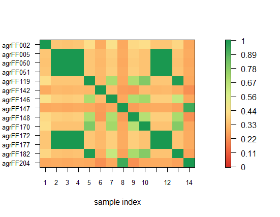

```

----[p.80]-----------------------------
Handling BLAST results

https://cran.r-project.org/web/packages/RFLPtools/RFLPtools.pdf

> install.packages("RFLPtools", dependencies = TRUE)
Installing package into ‘C:/Users/ekaminuma/Documents/R/win-library/3.2’
(as ‘lib’ is unspecified)

> library(RFLPtools)
> 
> DIR<-system.file("extdata",package="RFLPtools")
> DIR
[1] "C:/Users/ekaminuma/Documents/R/win-library/3.2/RFLPtools/extdata"
> 
> 
> MyF<- file.path(DIR,"BLASTexample.txt")
> MyF
[1] "C:/Users/ekaminuma/Documents/R/win-library/3.2/RFLPtools/extdata/BLASTexample.txt"
> 
> MyBL <- read.blast(file=MyF)


> head(MyBL)
  query.id subject.id identity alignment.length mismatches gap.opens
1 agrFF002   agrFF002   100.00              544          0         0
2 agrFF002   agrFF148    93.42              243         14         2
3 agrFF002   agrFF148   100.00               11          0         0
4 agrFF002   agrFF176    91.37              255         20         2
5 agrFF002   agrFF176   100.00               11          0         0
6 agrFF002   agrFF040    91.37              255         20         2
  q.start q.end s.start s.end   evalue bit.score
1       1   544       1   544  0.0e+00     944.0
2     199   439     671   913 6.0e-102     360.0
3     462   472     785   795  6.7e+00      21.1
4     187   439     123   377 2.0e-100     354.0
5     462   472     250   260  6.7e+00      21.1
6     187   439     121   375 2.0e-100     354.0
> 

> 

> test <-simMatrix(MyBL)
> test
          agrFF002  agrFF003  agrFF005  agrFF023  agrFF036  agrFF040
agrFF002 1.0000000 0.5142857 0.3645418 0.6389497 0.6409692 0.5065217
agrFF003 0.5142857 1.0000000 0.3846154 0.9912088 0.9801762 0.9736264
agrFF005 0.3645418 0.3846154 1.0000000 0.3829322 0.3876652 0.3804348
agrFF023 0.6389497 0.9912088 0.3829322 1.0000000 0.9911894 0.9759300
agrFF036 0.6409692 0.9801762 0.3876652 0.9911894 1.0000000 0.9691630
agrFF040 0.5065217 0.9736264 0.3804348 0.9759300 0.9691630 1.0000000
agrFF042 0.5154867 0.9800885 0.3871681 0.9889381 0.9845133 0.9823009
agrFF043 0.4458078 0.7274725 0.3680982 0.7264770 0.7290749 0.7195652

以下略

> dim(test)
[1] 62 62

------[追加①：配列長で行列数制限]-----------------------

アライメント長500以上を抽出して類似度行列計算

> test2<-simMatrix(MyBL,sequence.range=TRUE,Min=500) 
> dim(test2)
[1] 14 14

> MyBL$alignment.length　配列長の確認
   [1] 544 243  11 255  11 255  11 256  11 256
  [11]  11 256  11 255  11 255  11 254  11 254
  [21]  11 258  11 257  11 257  11 254  11 257
  [31]  11 235  11 259  11 245  11 245  11 245
  
> MyBL_500 <- subset(MyBL,MyBL$alignment.length>=500)
> id_all=union(MyBL_500$query.id,MyBL_500$subject.id)　ID抽出
> id_all
 [1] "agrFF002" "agrFF005" "agrFF050" "agrFF051" "agrFF119" "agrFF142"
 [7] "agrFF146" "agrFF147" "agrFF148" "agrFF170" "agrFF172" "agrFF177"
[13] "agrFF182" "agrFF204"
> length(id_all)　IDの個数は、類似度行列の次元と同じ
[1] 14

-----[追加②：類似度行列の視覚化]---------------------------
> library(MKmisc)  simPlot用のパッケージ
 次のパッケージを付け加えます: ‘MKmisc’ 

> simPlot(test2,minVal=0,labels=colnames(test2))
　　　　　　　　　　　　　　　　　14x14の類似度行列の視覚化
 
```





```
----------------------------------------------------
> data(BLASTdata)
> head(BLASTdata)
  query.id subject.id identity alignment.length mismatches gap.opens
1 agrFF002   agrFF002   100.00              544          0         0
2 agrFF002   agrFF148    93.42              243         14         2
3 agrFF002   agrFF148   100.00               11          0         0
4 agrFF002   agrFF176    91.37              255         20         2
5 agrFF002   agrFF176   100.00               11          0         0
6 agrFF002   agrFF040    91.37              255         20         2
  q.start q.end s.start s.end   evalue bit.score
1       1   544       1   544  0.0e+00     944.0
2     199   439     671   913 6.0e-102     360.0
3     462   472     785   795  6.7e+00      21.1
4     187   439     123   377 2.0e-100     354.0
5     462   472     250   260  6.7e+00      21.1
6     187   439     121   375 2.0e-100     354.0
> 
> 
> colnames(BLASTdata)
 [1] "query.id"         "subject.id"       "identity"        
 [4] "alignment.length" "mismatches"       "gap.opens"       
 [7] "q.start"          "q.end"            "s.start"         
[10] "s.end"            "evalue"           "bit.score"       
> 
> 

> 

-----------[p.84]-------------------------------


> library(Biostrings)
 要求されたパッケージ BiocGenerics をロード中です 
 要求されたパッケージ parallel をロード中です 　
　中略
> 
> NU <- DNAString("aacataatgcagtagtagaacccatgagccc")
> 
> 
> matchPattern(DNAString("ATG"),NU)
  Views on a 31-letter DNAString subject
subject: AACATAATGCAGTAGTAGAACCCATGAGCCC
views:
    start end width
[1]     7   9     3 [ATG]
[2]    24  26     3 [ATG]
> 
> 
> matchPattern("TAA",NU)
  Views on a 31-letter DNAString subject
subject: AACATAATGCAGTAGTAGAACCCATGAGCCC
views:
    start end width
[1]     5   7     3 [TAA]
> 

-----------------------------------------------
プログラムでstart codon/stop codonの
パターンマッチをまとめて行う。
※test_myCodonFinder.Rは添付ファイル参照

> source("test_myCodonFinder.R")
> 
> tmp_startstop<-test_myCodonFinder(NU)
> 
> tmp_startstop
$start
  Views on a 31-letter DNAString subject
subject: AACATAATGCAGTAGTAGAACCCATGAGCCC
views:
    start end width
[1]     7   9     3 [ATG]
[2]    24  26     3 [ATG]

$Stop
$Stop[[1]]
  Views on a 31-letter DNAString subject
subject: AACATAATGCAGTAGTAGAACCCATGAGCCC
views:
    start end width
[1]     5   7     3 [TAA]

$Stop[[2]]
  Views on a 31-letter DNAString subject
subject: AACATAATGCAGTAGTAGAACCCATGAGCCC
views:
    start end width
[1]    13  15     3 [TAG]
[2]    16  18     3 [TAG]

$Stop[[3]]
  Views on a 31-letter DNAString subject
subject: AACATAATGCAGTAGTAGAACCCATGAGCCC
views:
    start end width
[1]    25  27     3 [TGA]


-----------------------------------
左右(LR)のパターンを指定し、間の文字数を指定する
パターンマッチ関数：matchLRPatterns

> mytgt<-DNAString("AAATTAACCCTT")
> 
> mytgt
  12-letter "DNAString" instance
seq: AAATTAACCCTT


 
> matchLRPatterns("AA","TT", 5, mytgt)
  Views on a 12-letter DNAString subject
subject: AAATTAACCCTT
views:
    start end width
[1]     1   5     5 [AAATT]
[2]     2   5     4 [AATT]
[3]     6  12     7 [AACCCTT]
> 

 

> matchLRPatterns("AA","TT", 2, mytgt)
  Views on a 12-letter DNAString subject
subject: AAATTAACCCTT
views:
    start end width
[1]     1   5     5 [AAATT]
[2]     2   5     4 [AATT]
> 


```
