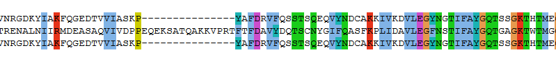
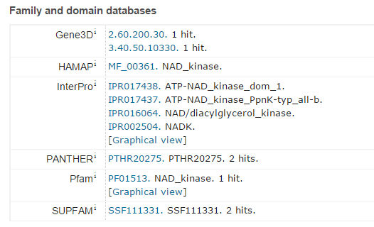
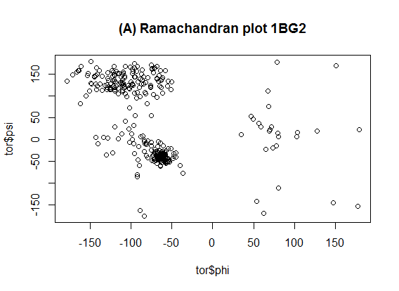
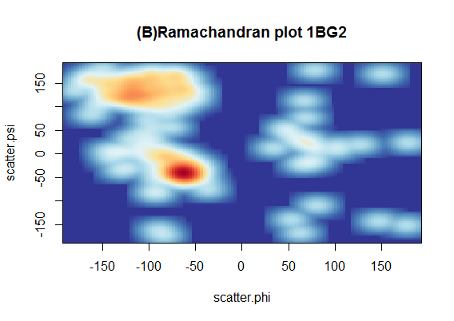
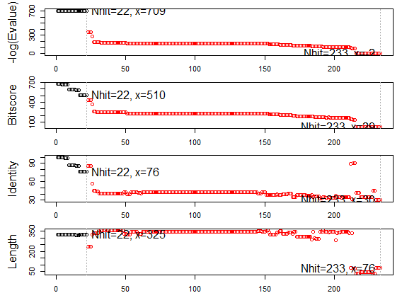
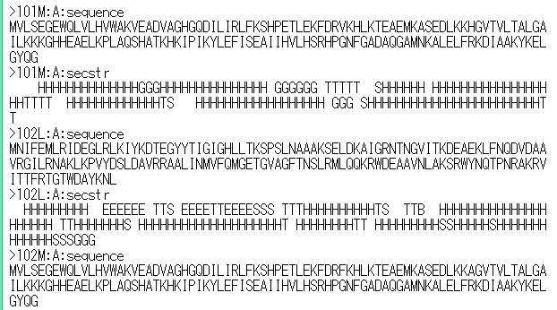

```


タンパク質関係のデータベースは、次の3種類がよく使われます
[1] タンパク質配列注釈＝UniProt
[2] タンパク質の立体構造＝PDB(Protein Data Bank)
[3] タンパク質の構造要素(ドメイン)＝InterPro

https://ja.wikipedia.org/wiki/Swiss-Prot
https://ja.wikipedia.org/wiki/%E8%9B%8B%E7%99%BD%E8%B3%AA%E6%A7%8B%E9%80%A0%E3%83%87%E3%83%BC%E3%82%BF%E3%83%90%E3%83%B3%E3%82%AF
https://ja.wikipedia.org/wiki/%E3%82%BF%E3%83%B3%E3%83%91%E3%82%AF%E8%B3%AA%E3%83%89%E3%83%A1%E3%82%A4%E3%83%B3


---[p.87]----------------------------------------------------

＜UniProtからの配列データ抽出＞


UniProtとは、欧EBIが提供する「タンパク質配列」の
機能注釈データベース
以下の4種類で構成されている。
 	名称	分類 
1 
UniProtKB 
タンパク質配列の注釈DB
(1)Swiss-Prot:手動キュレーション済DB
(2)TrEMBL: 自動注釈DB
2
UniParc
配列アーカイブ（公共DBからの抽出セット） 
3
UniRef	配列クラスタ 
4 
UniMes 
環境メタゲノム配列 


*biomartのライブラリが使えないので、p.89,8番～のUniProt.wsを使います
　

> source("http://bioconductor.org/biocLite.R")
Bioconductor version 3.1 (BiocInstaller 1.18.5), ?biocLite for
> biocLite();
BioC_mirror: http://bioconductor.org
Using Bioconductor version 3.1 (BiocInstaller 1.18.5), R version 3.2.2.
略

> biocLite("UniProt.ws")
BioC_mirror: http://bioconductor.org
Using Bioconductor version 3.1 (BiocInstaller 1.18.5), R version 3.2.2.
Installing package(s) ‘UniProt.ws’
trying URL 'http://bioconductor.org/packages/3.1/bioc/bin/windows/contrib/3.2/UniProt.ws_2.8.0.zip'
Content type 'application/zip' length 961852 bytes (939 KB)
downloaded 939 KB

package ‘UniProt.ws’ successfully unpacked and MD5 sums checked
> library(UniProt.ws)
 要求されたパッケージ RSQLite をロード中です 
 要求されたパッケージ DBI をロード中です 
 要求されたパッケージ RCurl をロード中です 
 要求されたパッケージ bitops をロード中です 
 要求されたパッケージ BiocGenerics をロード中です 
 要求されたパッケージ parallel をロード中です 

 次のパッケージを付け加えます: ‘BiocGenerics’ 
略

------------------------------------------------
> availableUniprotSpecies("musculus")
  taxon ID            Species name
1   520121     Anthocoris musculus
2   208057    Anthoscopus musculus
3   238007         Apomys musculus
4     9771   Balaenoptera musculus
5   197864    Blepharisma musculus
6    10090            Mus musculus
7    35531 Mus musculus bactrianus
8    10091  Mus musculus castaneus
9    57486 Mus musculus molossinus
> 
> availableUniprotSpecies("Homo")
  taxon ID                  Species name
1   111945          Homoroselaps lacteus
2    63221 Homo sapiens neanderthalensis
3     9606                  Homo sapiens
4   155619            Homobasidiomycetes

--------ヒトデータをセット------------------------------------
> UniProt.ws(9606)
"UniProt.ws" object:
An interface object for UniProt web services
Current Taxonomy ID:
9606
Current Species name:
Homo sapiens
To change Species see: help('availableUniprotSpecies')


> tmp <- UniProt.ws(9606) ヒトデータを選択

> species(tmp)
[1] "Homo sapiens"
> taxId(tmp)
[1] 9606
 ------利用可能なカラム--------------------------------------------------------
> columns(tmp)
  [1] "UNIPROTKB"                  "UNIPARC"                  
  [3] "UNIREF50"                   "UNIREF90"                 
  [5] "UNIREF100"                  "EMBL/GENBANK/DDBJ"        
  [7] "EMBL/GENBANK/DDBJ_CDS"      "PIR"                      
  [9] "UNIGENE"                    "ENTREZ_GENE"              
 [11] "GI_NUMBER*"                 "REFSEQ_PROTEIN"           
 [13] "REFSEQ_NUCLEOTIDE"          "PDB"                      
 [15] "DISPROT"                    "HSSP"                     
 [17] "DIP"                        "MINT"                     
 [19] "ALLERGOME"                  "MEROPS"                   
 [21] "PEROXIBASE"                 "PPTASEDB"                 
 [23] "REBASE"                     "TCDB"                     
 [25] "PHOSSITE"                   "DMDM"                     
 [27] "AARHUS/GHENT-2DPAGE"        "ECO2DBASE"                
 [29] "WORLD-2DPAGE"               "DNASU"                    
 [31] "ENSEMBL"                    "ENSEMBL_PROTEIN"          
 [33] "ENSEMBL_TRANSCRIPT"         "ENSEMBL_GENOMES"          
 [35] "ENSEMBL_GENOMES PROTEIN"    "ENSEMBL_GENOMES TRANSCRIPT"
 [37] "KEGG"                       "PATRIC"                   
 [39] "TIGR"                       "UCSC"                      [41] "VECTORBASE"                 "AGD"                       [43] "ARACHNOSERVER"              "CGD"                      
 [45] "CONOSERVER"                 "CYGD"                     
 [47] "DICTYBASE"                  "ECHOBASE"                 
　：
 略
　：
 [97] "DOMAINS"                    "DOMAIN"                   
　[99] "EC"                         "ID"                       
　[101] "EXISTENCE"                  "FAMILIES"                 [103] "FEATURES"                   "GENES"                   
　[105] "GO"                         "GO-ID"                   
　[107] "INTERPRO"                   "INTERACTOR"               [109] "KEYWORDS"                   "KEYWORD-ID"               [111] "LAST-MODIFIED"              "LENGTH"                   [113] "ORGANISM"                   "ORGANISM-ID"              [115] "PATHWAY"                    "REVIEWED"                 [117] "SCORE"                      "SEQUENCE"                 [119] "3D"                         "TAXON"                    [121] "TOOLS"                      "VERSION"                  [123] "DATABASE(PFAM)"             "DATABASE(PDB)"

-----------利用可能なkeytype--------------------

> keytypes(tmp)
 [1] "UNIPROTKB"                  "UNIPARC"                    "UNIREF50"                  
 [4] "UNIREF90"                   "UNIREF100"                  "EMBL/GENBANK/DDBJ"         
 [7] "EMBL/GENBANK/DDBJ_CDS"      "PIR"                        "UNIGENE"                   
[10] "ENTREZ_GENE"                "GI_NUMBER*"                 "REFSEQ_PROTEIN"            
[13] "REFSEQ_NUCLEOTIDE"          "PDB"                        "DISPROT"                   
[16] "HSSP"                       "DIP"                        "MINT"                      
[19] "ALLERGOME"                  "MEROPS"                     "PEROXIBASE"                
[22] "PPTASEDB"                   "REBASE"                     "TCDB"                      
[25] "PHOSSITE"                   "DMDM"                       "AARHUS/GHENT-2DPAGE"       
[28] "ECO2DBASE"                  "WORLD-2DPAGE"               "DNASU"                     
[31] "ENSEMBL"                    "ENSEMBL_PROTEIN"            "ENSEMBL_TRANSCRIPT"        
[34] "ENSEMBL_GENOMES"            "ENSEMBL_GENOMES PROTEIN"    "ENSEMBL_GENOMES TRANSCRIPT"
[37] "KEGG"                       "PATRIC"                     "TIGR"                      
[40] "UCSC"                       "VECTORBASE"                 "AGD"                       
[43] "ARACHNOSERVER"              "CGD"                        "CONOSERVER"                
[46] "CYGD"                       "DICTYBASE"                  "ECHOBASE"                  
[49] "ECOGENE"                    "EUHCVDB"                    "EUPATHDB"                  
[52] "FLYBASE"                    "GENECARDS"                  "GENEFARM"                  
[55] "GENOLIST"                   "H-INVDB"                    "HGNC"                      
[58] "HPA"                        "LEGIOLIST"                  "LEPROMA"                   
[61] "MAIZEGDB"                   "MIM"                        "MGI"                       
[64] "NEXTPROT"                   "ORPHANET"                   "PHARMGKB"                  
[67] "POMBASE"                    "PSEUDOCAP"                  "RGD"                       
[70] "SGD"                        "TAIR"                       "TUBERCULIST"               
[73] "WORMBASE"                   "WORMBASE_TRANSCRIPT"        "WORMBASE_PROTEIN"          
[76] "XENBASE"                    "ZFIN"                       "EGGNOG"                    
[79] "GENETREE"                   "HOGENOM"                    "HOVERGEN"                  
[82] "KO"                         "OMA"                        "ORTHODB"                   
[85] "PROTCLUSTDB"                "BIOCYC"                     "REACTOME"                  
[88] "UNIPATHWAY"                 "CLEANEX"                    "GERMONLINE"                
[91] "DRUGBANK"                   "GENOMERNAI"                 "NEXTBIO"  

-------データの抽出--------------------------------------------------

UniProtのIDをキーにして、PDB番号と配列を取得する。

> select(tmp, keys=c("P31946"), columns=c("PDB","SEQUENCE"), keytype="UNIPROTKB")
Getting mapping data for P31946 ... and PDB_ID
Getting extra data for P31946 NA NA etc
  UNIPROTKB  PDB
1    P31946 2BQ0
2    P31946 2C23
3    P31946 4DNK
                                                                                                                                                                                                                                                SEQUENCE
1 MTMDKSELVQKAKLAEQAERYDDMAAAMKAVTEQGHELSNEERNLLSVAYKNVVGARRSSWRVISSIEQKTERNEKKQQMGKEYREKIEAELQDICNDVLELLDKYLIPNATQPESKVFYLKMKGDYFRYLSEVASGDNKQTTVSNSQQAYQEAFEISKKEMQPTHPIRLGLALNFSVFYYEILNSPEKACSLAKTAFDEAIAELDTLNEESYKDSTLIMQLLRDNLTLWTSENQGDEGDAGEGEN
2 MTMDKSELVQKAKLAEQAERYDDMAAAMKAVTEQGHELSNEERNLLSVAYKNVVGARRSSWRVISSIEQKTERNEKKQQMGKEYREKIEAELQDICNDVLELLDKYLIPNATQPESKVFYLKMKGDYFRYLSEVASGDNKQTTVSNSQQAYQEAFEISKKEMQPTHPIRLGLALNFSVFYYEILNSPEKACSLAKTAFDEAIAELDTLNEESYKDSTLIMQLLRDNLTLWTSENQGDEGDAGEGEN
3 MTMDKSELVQKAKLAEQAERYDDMAAAMKAVTEQGHELSNEERNLLSVAYKNVVGARRSSWRVISSIEQKTERNEKKQQMGKEYREKIEAELQDICNDVLELLDKYLIPNATQPESKVFYLKMKGDYFRYLSEVASGDNKQTTVSNSQQAYQEAFEISKKEMQPTHPIRLGLALNFSVFYYEILNSPEKACSLAKTAFDEAIAELDTLNEESYKDSTLIMQLLRDNLTLWTSENQGDEGDAGEGEN
 
---------[p.90の12番]----------------------------------------------


> O95544 <- select(tmp, keys=c("O95544"), columns=c("PDB","ENSEMBL","GO-ID","SEQUENCE"), keytype="UNIPROTKB")
Getting mapping data for O95544 ... and PDB_ID
Getting mapping data for O95544 ... and ENSEMBL_ID
Getting extra data for O95544 NA NA etc
> 
> O95544
  UNIPROTKB  PDB         ENSEMBL
1    O95544 3PFN ENSG00000008130
                                                                                                                               GO-ID
1 GO:0005524; GO:0046034; GO:0019674; GO:0003951; GO:0006741; GO:0005829; GO:0046872; GO:0016310; GO:0044281; GO:0006766; GO:0006767
                                                                                                                                                                                                                                                                                                                                                                                                                                                        SEQUENCE
1 MEMEQEKMTMNKELSPDAAAYCCSACHGDETWSYNHPIRGRAKSRSLSASPALGSTKEFRRTRSLHGPCPVTTFGPKACVLQNPQTIMHIQDPASQRLTWNKSPKSVLVIKKMRDASLLQPFKELCTHLMEENMIVYVEKKVLEDPAIASDESFGAVKKKFCTFREDYDDISNQIDFIICLGGDGTLLYASSLFQGSVPPVMAFHLGSLGFLTPFSFENFQSQVTQVIEGNAAVVLRSRLKVRVVKELRGKKTAVHNGLGENGSQAAGLDMDVGKQAMQYQVLNEVVIDRGPSSYLSNVDVYLDGHLITTVQGDGVIVSTPTGSTAYAAAAGASMIHPNVPAIMITPICPHSLSFRPIVVPAGVELKIMLSPEARNTAWVSFDGRKRQEIRHGDSISITTSCYPLPSICVRDPVSDWFESLAQCLHWNVRKKQAHFEEEEEEEEEG


> O95544$SEQUENCE
[1] "MEMEQEKMTMNKELSPDAAAYCCSACHGDETWSYNHPIRGRAKSRSLSASPALGSTKEFRRTRSLHGPCPVTTFGPKACVLQNPQTIMHIQDPASQRLTWNKSPKSVLVIKKMRDASLLQPFKELCTHLMEENMIVYVEKKVLEDPAIASDESFGAVKKKFCTFREDYDDISNQIDFIICLGGDGTLLYASSLFQGSVPPVMAFHLGSLGFLTPFSFENFQSQVTQVIEGNAAVVLRSRLKVRVVKELRGKKTAVHNGLGENGSQAAGLDMDVGKQAMQYQVLNEVVIDRGPSSYLSNVDVYLDGHLITTVQGDGVIVSTPTGSTAYAAAAGASMIHPNVPAIMITPICPHSLSFRPIVVPAGVELKIMLSPEARNTAWVSFDGRKRQEIRHGDSISITTSCYPLPSICVRDPVSDWFESLAQCLHWNVRKKQAHFEEEEEEEEEG"


=============[p.92]======================================

＜Protein Sequence解析＞

http://thegrantlab.org/bio3d/index.php


> install.packages("bio3d")
Installing package into ‘C:/Users/ekaminuma/Documents/R/win-library/3.2’
(as ‘lib’ is unspecified)
trying URL 'http://cran.rstudio.com/bin/windows/contrib/3.2/bio3d_2.2-4.zip'
Content type 'application/zip' length 2740772 bytes (2.6 MB)
downloaded 2.6 MB

package ‘bio3d’ successfully unpacked and MD5 sums checked

The downloaded binary packages are in
	C:\Users\ekaminuma\AppData\Local\Temp\Rtmp0qzd6i\downloaded_packages
> 
> library(bio3d)
Warning message:
 パッケージ ‘bio3d’ はバージョン 3.2.3 の R の下で造られました


=======[p.93]===============================

＜Protein sequence alignment＞


> library(muscle)  以前利用したライブラリ 
 

> pdb1<-read.pdb("1BG2")
  Note: Accessing on-line PDB file
  HEADER    MOTOR PROTEIN                           04-JUN-98   1BG2               
> pdb2<-read.pdb("2VVG")
  Note: Accessing on-line PDB file
  HEADER    MOTOR PROTEIN                           08-JUN-08   2VVG               
> 
> pdb3<-read.pdb("1MKJ")
  Note: Accessing on-line PDB file
  HEADER    TRANSPORT PROTEIN                       29-AUG-02   1MKJ       


> s1<- aa321(pdb1$seqres)
> s2<- aa321(pdb2$seqres)
> s3<- aa321(pdb3$seqres)
> 
> s1
  [1] "M" "A" "D" "L" "A" "E" "C" "N" "I" "K" "V" "M" "C" "R" "F" "R" "P"
略

> raw<- seqbind(seqbind(s1,s2),s3)
> raw
       1        .         .         .         .         .         .         70 
seq1   MADLAECNIKVMCRFRPLNESEVNRGDKYIAKFQGEDTVVIASKPYAFDRVFQSSTSQEQVYNDCAKKIV
seq2   MSSDNIKVIVRCRPLNARETRENALNIIRMDEASAQVIVDPPEQEKSATQAKKVPRTFTFDAVYDQTSCN
seq3   MADLAECNIKVMCRFRPLNESEVNRGDKYIAKFQGEDTVVIASKPYAFDRVFQSSTSQEQVYNDCAKKIV
       *       *            *       ^    ^   *                 ^              
       1        .         .         .         .         .         .         70 
＜略＞


一旦、fasta形式ファイルに保存。
> write.fasta(raw,ids=c("1BG2","2VVG","1MKJ"),file="raw_pdb.fa")


> pdb_seq <-readAAStringSet("raw_pdb.fa",format="fasta")
> 
> pdb_seq
  A AAStringSet instance of length 3
    width seq                                        names               
[1]   700 MADLAECNIKVMCRFRPLNE...------------------- 1BG2
[2]   700 MSSDNIKVIVRCRPLNARET...AKQIKNKPRINEDPKDAQI 2VVG
[3]   700 MADLAECNIKVMCRFRPLNE...------------------- 1MKJ
> 
> pdb_aln <- muscle(pdb_seq,out=NULL,quiet=FALSE)
Option -out must have value
Invalid option "out"

MUSCLE v3.8.31 by Robert C. Edgar

http://www.drive5.com/muscle
This software is donated to the public domain.
Please cite: Edgar, R.C. Nucleic Acids Res 32(5), 1792-97.


Basic usage

    muscle -in <inputfile> -out <outputfile>

Common options (for a complete list please see the User Guide):

    -in <inputfile>    Input file in FASTA format (default stdin)
    -out <outputfile>  Output alignment in FASTA format (default stdout)
    -diags             Find diagonals (faster for similar sequences)
    -maxiters <n>      Maximum number of iterations (integer, default 16)
    -maxhours <h>      Maximum time to iterate in hours (default no limit)
    -html              Write output in HTML format (default FASTA)
    -msf               Write output in GCG MSF format (default FASTA)
    -clw               Write output in CLUSTALW format (default FASTA)
    -clwstrict         As -clw, with 'CLUSTAL W (1.81)' header
    -log[a] <logfile>  Log to file (append if -loga, overwrite if -log)
    -quiet             Do not write progress messages to the screen
    -version           Display version information and exit

Without refinement (very fast, avg accuracy similar to T-Coffee): -maxiters 2
Fastest possible (amino acids): -maxiters 1 -diags -sv -distance1 kbit20_3
Fastest possible (nucleotides): -maxiters 1 -diags
file141c35174058 3 seqs, max length 700, avg  length 458
181 MB(1%)00:00:00                Iter   1  100.00%  K-mer dist pass 1
181 MB(1%)00:00:00                Iter   1  100.00%  K-mer dist pass 2
181 MB(1%)00:00:00                Iter   1  100.00%  Align node       
181 MB(1%)00:00:00                Iter   1  100.00%  Root alignment
181 MB(1%)00:00:00                Iter   2  100.00%  Root alignment
181 MB(1%)00:00:00                Iter   3  100.00%  Refine biparts
181 MB(1%)00:00:00                Iter   4  100.00%  Refine biparts
181 MB(1%)00:00:00                Iter   5  100.00%  Refine biparts
181 MB(1%)00:00:00                Iter   6  100.00%  Refine biparts
181 MB(1%)00:00:00                Iter   7  100.00%  Refine biparts
> 
> AAStr <- as(pdb_aln,"AAStringSet")
> writeXStringSet(AAStr,file="pdb_aln.fa")

> tmpdat <- read.fasta(file="pdb_aln.fa")
　　　　　AAStrでなくid+seq形式のtmpdat作成 

> aln2html(tmpdat,append=FALSE,file="pdb_aln.html")

```

```
pdb_aln.faとpdb_aln.htmlは添付ファイル参照 
 
=======[p.95]===============================

＜Amino Acid Composition＞


> install.packages("protr")
> 
> library(bio3d)
> library(protr)
Warning message:
 パッケージ ‘protr’ はバージョン 3.2.3 の R の下で造られました  
> 
> pdb1 <- read.pdb("1BG2")
  Note: Accessing on-line PDB file
  HEADER    MOTOR PROTEIN                           04-JUN-98   1BG2               
 
> s1 <- aa321(pdb1$seqres)
>
> s1 <- paste(s1,sep="",collapse="")
> s1
[1] "MADLAECNIKVMCRFRPLNESEVNRGDKYIAKFQGEDTVVIASKPYAFDRVFQSSTSQEQVYNDCAKKIVKDVLEGYNGTIFAYGQTSSGKTHTMEGKLHDPEGMGIIPRIVQDIFNYIYSMDENLEFHIKVSYFEIYLDKIRDLLDVSKTNLSVHEDKNRVPYVKGCTERFVCSPDEVMDTIDEGKSNRHVAVTNMNEHSSRSHSIFLINVKQENTQTEQKLSGKLYLVDLAGSEKVSKTGAEGAVLDEAKNINKSLSALGNVISALAEGSTYVPYRDSKMTRILQDSLGGNCRTTIVICCSPSSYNESETKSTLLFGQRAKTI"
 
> library(seqinr)
 
> s1tmp <- c2s(s1) 
> s1tmp
[1] "MADLAECNIKVMCRFRPLNESEVNRGDKYIAKFQGEDTVVIASKPYAFDRVFQSSTSQEQVYNDCAKKIVKDVLEGYNGTIFAYGQTSSGKTHTMEGKLHDPEGMGIIPRIVQDIFNYIYSMDENLEFHIKVSYFEIYLDKIRDLLDVSKTNLSVHEDKNRVPYVKGCTERFVCSPDEVMDTIDEGKSNRHVAVTNMNEHSSRSHSIFLINVKQENTQTEQKLSGKLYLVDLAGSEKVSKTGAEGAVLDEAKNINKSLSALGNVISALAEGSTYVPYRDSKMTRILQDSLGGNCRTTIVICCSPSSYNESETKSTLLFGQRAKTI"

------[1.アミノ酸組成の取得]----------------------

> s1_aac <- extractAAC(s1tmp)
> s1_aac
         A          R          N          D          C          E          Q 
0.04923077 0.04307692 0.05846154 0.06153846 0.02461538 0.07384615 0.03384615 
         G          H          I          L          K          M          F 
0.06153846 0.02153846 0.06769231 0.06769231 0.07692308 0.02461538 0.03384615 
         P          S          T          W          Y          V 
0.02461538 0.09538462 0.06153846 0.00000000 0.04307692 0.07692308 

------[2.クエリ配列が20種類アミノ酸持つか]-----------
> s1_check <- protcheck(s1tmp)
> 
> s1_check
[1] TRUE

------[3.疎水性/親水性アミノ酸(hydrophobic/hydrophilic)]---
> s1_apaac <- extractAPAAC(s1tmp,props=c("Hydrophobicity","Hydrophilicity"),lambda=30,w=0.05,customprops=NULL)
> 
> s1_apaac
                Pc1.A                 Pc1.R                 Pc1.N 
         1.559274e+01          1.364365e+01          1.851638e+01 
                Pc1.D                 Pc1.C                 Pc1.E 
         1.949093e+01          7.796371e+00          2.338911e+01 
                Pc1.Q                 Pc1.G                 Pc1.H 
         1.072001e+01          1.949093e+01          6.821824e+00 
                Pc1.I                 Pc1.L                 Pc1.K 
         2.144002e+01          2.144002e+01          2.436366e+01 
                Pc1.M                 Pc1.F                 Pc1.P 
         7.796371e+00          1.072001e+01          7.796371e+00 
                Pc1.S                 Pc1.T                 Pc1.W 
         3.021094e+01          1.949093e+01          0.000000e+00 
                Pc1.Y                 Pc1.V  Pc2.Hydrophobicity.1 
         1.364365e+01          2.436366e+01         -2.191252e-03 
 Pc2.Hydrophilicity.1  Pc2.Hydrophobicity.2  Pc2.Hydrophilicity.2 
         1.807624e-03         -3.394759e-03         -4.43412
略
Pc2.Hydrophobicity.30 Pc2.Hydrophilicity.30 
         3.394123e-03          6.391990e-03 


> extractCTDC(s1tmp)  CTD composition
 hydrophobicity.Group1  hydrophobicity.Group2  hydrophobicity.Group3 
             0.3476923              0.3569231              0.2953846 
normwaalsvolume.Group1 normwaalsvolume.Group2 normwaalsvolume.Group3 
             0.3784615              0.3784615              0.2430769 
       polarity.Group1        polarity.Group2        polarity.Group3 
             0.3384615              0.2923077              0.3692308 
 polarizability.Group1  polarizability.Group2  polarizability.Group3 
             0.3292308              0.4276923              0.2430769 
         charge.Group1          charge.Group2          charge.Group3 
             0.1200000              0.7446154              0.1353846 
secondarystruct.Group1 secondarystruct.Group2 secondarystruct.Group3 
             0.3907692              0.3076923              0.3015385 
  solventaccess.Group1   solventaccess.Group2   solventaccess.Group3 
             0.3815385              0.3476923              0.2707692 
> 
> extractCTDD(s1tmp)　　　CTD distibution
  prop1.G1.residue0  prop1.G1.residue25  prop1.G1.residue50 
          0.9230769          20.9230769          48.3076923 
 prop1.G1.residue75 prop1.G1.residue100   prop1.G2.residue0 
         68.3076923          99.3846154           0.6153846 
 prop1.G2.residue25  prop1.G2.residue50  prop1.G2.residue75 
         27.0769231          56.0000000          80.0000000 
prop1.G2.residue100   prop1.G3.residue0  prop1.G3.residue25 
         99.6923077           0.3076923          22.7692308 
 prop1.G3.residue50  prop1.G3.residue75 prop1.G3.residue100 
         45.5384615          71.3846154         100.0000000 
  prop2.G1.residue0  prop2.G1.residue25  prop2.G1.residue50 
          0.6153846          25.5384615          54.1538462 
 prop2.G1.residue75 prop2.G1.residue100   prop2.G2.residue0 
         80.0000000          99.6923077           1.2307692 
 略          
 prop7.G1.residue75 prop7.G1.residue100   prop7.G2.residue0 
         76.0000000         100.0000000           0.9230769 
 prop7.G2.residue25  prop7.G2.residue50  prop7.G2.residue75 
         20.9230769          48.3076923          68.3076923 
prop7.G2.residue100   prop7.G3.residue0  prop7.G3.residue25 
         99.3846154           0.3076923          28.6153846 
 prop7.G3.residue50  prop7.G3.residue75 prop7.G3.residue100 
         53.8461538          79.6923077          99.6923077 
 
> extractDC(s1tmp)　Dipeptide Composition 
         AA          RA          NA          DA          CA          EA 
0.000000000 0.003086420 0.000000000 0.000000000 0.003086420 0.003086420 
         QA          GA          HA          IA          LA          KA 
0.000000000 0.006172840 0.000000000 0.006172840 0.009259259 0.000000000 
略
         LV          KV          MV          FV          PV          SV 
0.003086420 0.009259259 0.000000000 0.003086420 0.000000000 0.003086420 
         TV          WV          YV          VV 
0.003086420 0.000000000 0.006172840 0.003086420 


その他の関数情報
https://cran.r-project.org/web/packages/protr/vignettes/protr.pdf

=======[p.97]=============================

＜C-alpha coordinates＞

> class(pdb1)
[1] "pdb" "sse"
> 
> attributes(pdb1)
$names
[1] "atom"   "helix"  "sheet"  "seqres" "xyz"    "calpha" "remark" "call"  

$class
[1] "pdb" "sse"


> summary(pdb1)

 Call:  read.pdb(file = "1BG2")

   Total Models#: 1
     Total Atoms#: 2733,  XYZs#: 8199  Chains#: 1  (values: A)

     Protein Atoms#: 2527  (residues/Calpha atoms#: 323)
     Nucleic acid Atoms#: 0  (residues/phosphate atoms#: 0)

     Non-protein/nucleic Atoms#: 206  (residues: 174)
     Non-protein/nucleic resid values: [ ACT (3), ADP (1), HOH (169), MG (1) ]

+ attr: atom, helix, sheet, seqres, xyz,
        calpha, remark, call


> head(pdb1$atom[,c("x","y","z")])
       x      y      z
1 43.743 -2.106 39.408
2 45.053 -2.661 39.856
3 45.305 -2.401 41.340
4 46.119 -3.083 41.957
5 46.204 -2.067 39.034
6 45.912 -2.039 37.542
> 
> head(pdb1$atom[pdb1$calpha,c("resid","elety","x","y","z")])
   resid elety      x      y      z
2    ASP    CA 45.053 -2.661 39.856
10   LEU    CA 44.791 -1.079 43.319
18   ALA    CA 42.451 -3.691 44.790
23   GLU    CA 40.334 -4.572 41.737
32   CYS    CA 36.711 -3.532 42.171
38   ASN    CA 36.940 -0.636 44.620
> 

> write.pdb(pdb1,file="tmp_1BG2.pdb")
> read.pdb("tmp_1BG2.pdb")

 Call:  read.pdb(file = "tmp_1BG2.pdb")

   Total Models#: 1
     Total Atoms#: 2733,  XYZs#: 8199  Chains#: 1  (values: A)
略

=======[p.98]============================

＜Interpro annotation＞


> library(UniProt.ws)
> tmp <- UniProt.ws(9606)

> O95544 <- select(tmp, keys=c("O95544"), columns=c("PDB","INTERPRO","GO-ID"), keytype="UNIPROTKB")
Getting mapping data for O95544 ... and PDB_ID
Getting extra data for O95544 NA NA etc
> O95544
  UNIPROTKB  PDB                                     INTERPRO
1    O95544 3PFN IPR017438; IPR017437; IPR016064; IPR002504; 
                                                                                                                               GO-ID
1 GO:0005524; GO:0046034; GO:0019674; GO:0003951; GO:0006741; GO:0005829; GO:0046872; GO:0016310; GO:0044281; GO:0006766; GO:0006767


http://www.uniprot.org/uniprot/O95544

```

```

======[p.100]========================

＜Ramachandran plot＞
 

> tor <- torsion.pdb(pdb1)
> 
> plot(tor$phi,tor$psi,main="(A) Ramachandran plot 1BG2")

```

```

> scatter.psi <- tor$psi
> scatter.phi <- tor$phi
> 
> library(RColorBrewer)
> k <- 10
> my.col <- rev(brewer.pal(k,"RdYlBu"))
> 
> smoothScatter(x=scatter.phi,y=scatter.psi,colramp=colorRampPalette(my.col),main="(B)Ramachandran plot 1BG2",pch=19,cex=0.00)
> 

```

```


======[p.102]========================

＜Searching for similar proteins＞


> 
> tmpseq <- aa321(pdb1$seqres)
> 
> tmpblast <- blast.pdb(tmpseq)
 Searching ... please wait (updates every 5 seconds) RID = 727A1WY101N 
 
 Reporting 233 hits
> 
> head(tmpblast$hit.tbl)
     queryid   subjectids                identity  positives alignmentlength
[1,] "unnamed" "gi|24987772|pdb|1MKJ|A"  "100.000" "100.00"  "325"          
[2,] "unnamed" "gi|157830287|pdb|1BG2|A" "100.000" "100.00"  "325"          
[3,] "unnamed" "gi|193885175|pdb|2P4N|K" "100.000" "100.00"  "325"          
[4,] "unnamed" "gi|731187722|pdb|3J8X|K" " 99.077" " 99.08"  "325"          
[5,] "unnamed" "gi|731187725|pdb|3J8Y|K" " 99.077" " 99.08"  "325"          
[6,] "unnamed" "gi|406855617|pdb|4ATX|C" " 98.769" " 99.38"  "325"          
     mismatches gapopens q.start q.end s.start s.end evalue      bitscore
[1,] "  0"      " 0"     "  1"   "325" "  1"   "325" " 0.00e+00" "677.0" 
[2,] "  0"      " 0"     "  1"   "325" "  1"   "325" " 0.00e+00" "675.0" 
[3,] "  0"      " 0"     "  1"   "325" "  1"   "325" " 0.00e+00" "675.0" 
[4,] "  3"      " 0"     "  1"   "325" "  1"   "325" " 0.00e+00" "669.0" 
[5,] "  3"      " 0"     "  1"   "325" "  1"   "325" " 0.00e+00" "669.0" 

```

```

> top.hits <- plot(tmpblast)
  * Possible cutoff values:    709 -2 
            Yielding Nhits:    22 233 

  * Chosen cutoff value of:    709 
            Yielding Nhits:    22 
> head(top.hits$hits)
  pdb.id   gi.id       group
1 "1MKJ_A" "24987772"  "1"  
2 "1BG2_A" "157830287" "1"  
3 "2P4N_K" "193885175" "1"  
4 "3J8X_K" "731187722" "1"  
5 "3J8Y_K" "731187725" "1"  
6 "4ATX_C" "406855617" "1"  


======[p.105]========================

＜Working with the secondary structure features of proteins＞

Secondary structure(SS)

http://www.rcsb.org/pdb/files/ss.txt
```

```

読み込みエラーになるのでソフトウェアを直接利用。

======[p.105]========================

＜3D Visualization＞


R2.2.3ではサポートしておらず。
インストールエラーになるので、視覚化ソフトウェアを直接利用。


```
