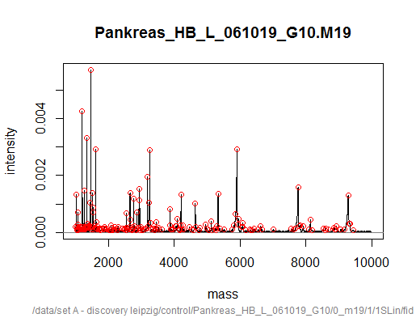
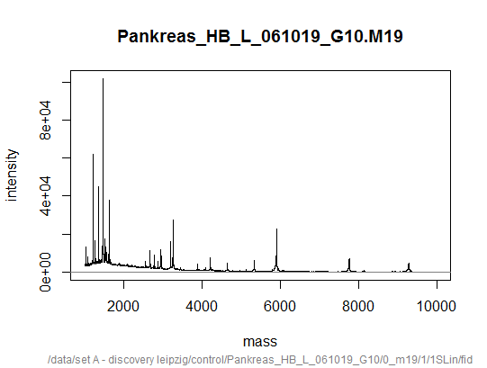
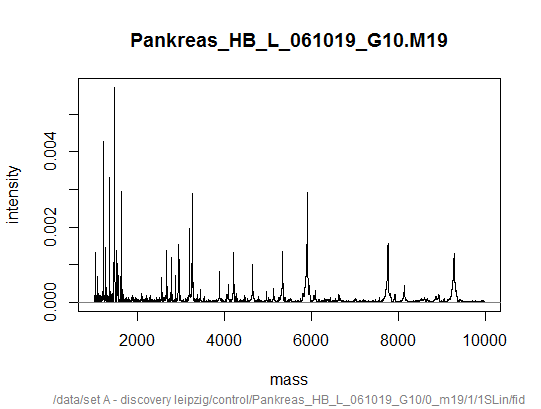

```

---[p211]---------------------------
Peak Detection in MS data


> library(MALDIquant) 
> data("fiedler2009subset",package="MALDIquant")
> mydat1 <- fiedler2009subset[[1]]

> spec1 <- transformIntensity(mydat1, method="sqrt")
> spec2 <- smoothIntensity(spec1,method="SavitzkyGolay")
> spec3 <- removeBaseline(spec2)
> spec4 <- calibrateIntensity(spec3,method="TIC")
> 
> peak <- detectPeaks(spec4,method="MAD",SNR=2)

ユーザが定義したノイズ閾値より大きいピークを検出する。
SNR（signal-to-noise ratio）: 信号ノイズ比
peak > noise x SNR

MAD(Median Absolute Deviation)はノイズを推定する方法。
https://en.wikipedia.org/wiki/Median_absolute_deviation

> peak
S4 class type            : MassPeaks                   
Number of m/z values     : 207                         
Range of m/z values      : 1012.802 - 9436.587         
Range of intensity values: 7.841e-05 - 5.718e-03       
Range of snr values      : 2.035 - 148.412             
Memory usage             : 13.469 KiB                  
Name                     : Pankreas_HB_L_061019_G10.M19
File                     : /data/set A - discovery leipzig/control/Pankreas_HB_L_061019_G10/0_m19/1/1SLin/fid
> 

> str(peak)
Formal class 'MassPeaks' [package "MALDIquant"] with 4 slots
  ..@ snr      : num [1:207] 5.01 34.73 2.41 2.26 5.08 ...
  ..@ mass     : num [1:207] 1013 1021 1042 1046 1057 ...
  ..@ intensity: num [1:207] 1.93e-04 1.34e-03 9.27e-05 8.69e-05 1.96e-04 ...
  ..@ metaData :List of 42
  .. ..$ byteOrder           : chr "little"
  .. ..$ number              : num 42388
  .. ..$ timeDelay           : num 19886
  .. ..$ timeDelta           : num 1
  .. ..$ calibrationConstants: Named num [1:3] 2.60e+06 2.68e+02 -4.43e-03
  .. .. ..- attr(*, "names")= chr [1:3] "c1" "c2" "c3"
  .. ..$ hpcLimits           : Named num [1:2] 0 0
  .. .. ..- attr(*, "names")= chr [1:2] "minMass" "maxMass"
  .. ..$ hpcOrder            : num 0
<以下略>

> 
> plot(spec4)
> points(peak,col="red")
> 
```



```


---[p214]---------------------------
Peak Alignment with MS data

> library(MALDIquant) 
> data("fiedler2009subset",package="MALDIquant")
> 
> mydat <- fiedler2009subset
> 
> mydat
$sPankreas_HB_L_061019_G10.M19.T_0209513_0020740_18
S4 class type            : MassSpectrum                
Number of m/z values     : 42388                       
Range of m/z values      : 1000.015 - 9999.734         
Range of intensity values: 5 - 101840                  
Memory usage             : 505.367 KiB
<以下略>

> spec1 <- transformIntensity(mydat, method="sqrt")
> 
> spec2 <- smoothIntensity(spec1,method="SavitzkyGolay")
> 
> spec3 <- removeBaseline(spec2)
> 
> spec4 <- calibrateIntensity(spec3,method="TIC")
> 
> spectra <- alignSpectra(spec4)

> summary(mydat)
                                                   Length Class        Mode
sPankreas_HB_L_061019_G10.M19.T_0209513_0020740_18 42388  MassSpectrum S4  
sPankreas_HB_L_061019_G10.M20.T_0209513_0020740_18 42388  MassSpectrum S4  
sPankreas_HB_L_061019_H7.O14.T_0209513_0020740_18  42388  MassSpectrum S4  
sPankreas_HB_L_061019_H7.P13.T_0209513_0020740_18  42388  MassSpectrum S4  
sPankreas_HB_L_061019_F10.L19.T_0209513_0020740_18 42388  MassSpectrum S4  
sPankreas_HB_L_061019_F10.L20.T_0209513_0020740_18 42388  MassSpectrum S4  
sPankreas_HB_L_061019_F9.L17.T_0209513_0020740_18  42388  MassSpectrum S4  
sPankreas_HB_L_061019_F9.L18.T_0209513_0020740_18  42388  MassSpectrum S4  
sPankreas_HB_L_061019_A6.A11.T_0209513_0020740_18  42388  MassSpectrum S4  
sPankreas_HB_L_061019_A6.A12.T_0209513_0020740_18  42388  MassSpectrum S4  
sPankreas_HB_L_061019_A8.A15.T_0209513_0020740_18  42388  MassSpectrum S4  
sPankreas_HB_L_061019_A8.A16.T_0209513_0020740_18  42388  MassSpectrum S4  
sPankreas_HB_L_061019_C4.F7.T_0209513_0020740_18   42388  MassSpectrum S4  
sPankreas_HB_L_061019_C4.F8.T_0209513_0020740_18   42388  MassSpectrum S4  
sPankreas_HB_L_061019_D9.G17.T_0209513_0020740_18  42388  MassSpectrum S4  
sPankreas_HB_L_061019_D9.G18.T_0209513_0020740_18  42388  MassSpectrum S4  
> 
> summary(spectra)
      Length Class        Mode
 [1,] 42388  MassSpectrum S4  
 [2,] 42388  MassSpectrum S4  
 [3,] 42388  MassSpectrum S4  
 [4,] 42388  MassSpectrum S4  
 [5,] 42388  MassSpectrum S4  
 [6,] 42388  MassSpectrum S4  
 [7,] 42388  MassSpectrum S4  
 [8,] 42388  MassSpectrum S4  
 [9,] 42388  MassSpectrum S4  
[10,] 42388  MassSpectrum S4  
[11,] 42388  MassSpectrum S4  
[12,] 42388  MassSpectrum S4  
[13,] 42388  MassSpectrum S4  
[14,] 42388  MassSpectrum S4  
[15,] 42388  MassSpectrum S4  
[16,] 42388  MassSpectrum S4  
> 
> plot(mydat[[1]])
> 
```

```
> plot(spectra[[1]])
> 
```

```

------------[p.216]-----------------
Peptide identification in MS data

> install.packages("protViz",dependencies=TRUE)
> library(protViz)
Warning message:
 パッケージ ‘protViz’ はバージョン 3.2.3 の R の下で造られました  
> 
> pep1 <- "SHCIAEVENDEMPADLPSLAADFVESK"
> 
> mydat1 <- fiedler2009subset[[1]]
> 
> 
> spec1 <- transformIntensity(mydat1, method="sqrt")
> spec2 <- smoothIntensity(spec1,method="SavitzkyGolay")
> spec3 <- removeBaseline(spec2)
> spec4 <- calibrateIntensity(spec3,method="TIC")
> 
> spec5 <- list(title="artificial",charge=2, mZ=spec4@mass,intensity=spec4@intensity)
> 
> n <- nchar(pep1)
> n
[1] 27
> 
> fi <- fragmentIon(pep1)  Ionはsがないので注意
> 
> fi
[[1]]
            b         y         c         z
1    88.03931  147.1128  105.0659  130.0863
2   225.09822  234.1448  242.1248  217.1183
3   385.12887  363.1874  402.1554  346.1609
4   498.21293  462.2558  515.2395  445.2293
5   569.25004  609.3242  586.2766  592.2977
6   698.29263  724.3512  715.3192  707.3246
7   797.36104  795.3883  814.3876  778.3617
8   926.40363  866.4254  943.4302  849.3989
9  1040.44655  979.5095 1057.4731  962.4829
10 1155.47349 1066.5415 1172.5000 1049.5149
11 1284.51608 1163.5943 1301.5426 1146.5677
12 1415.55656 1276.6783 1432.5831 1259.6518
13 1512.60932 1391.7053 1529.6359 1374.6787
14 1583.64643 1462.7424 1600.6730 1445.7158
15 1698.67337 1559.7951 1715.6999 1542.7686
16 1811.75743 1690.8356 1828.7840 1673.8091
17 1908.81019 1819.8782 1925.8367 1802.8516
18 1995.84222 1934.9051 2012.8688 1917.8786
19 2108.92629 2048.9481 2125.9528 2031.9215
20 2179.96340 2177.9907 2196.9899 2160.9641
21 2251.00051 2277.0591 2268.0271 2260.0325
22 2366.02745 2406.1017 2383.0540 2389.0751
23 2513.09586 2477.1388 2530.1224 2460.1122
24 2612.16427 2590.2228 2629.1908 2573.1963
25 2741.20686 2750.2535 2758.2334 2733.2269
26 2828.23889 2887.3124 2845.2654 2870.2858
27 2956.33385 2974.3444 2973.3604 2957.3179
 
> by_mZ <- c(fi[[1]]$b,fi[[1]]$y)
> by_mZ
 [1]   88.03931  225.09822  385.12887  498.21293  569.25004  698.29263
 [7]  797.36104  926.40363 1040.44655 1155.47349 1284.51608 1415.55656
[13] 1512.60932 1583.64643 1698.67337 1811.75743 1908.81019 1995.84222
[19] 2108.92629 2179.96340 2251.00051 2366.02745 2513.09586 2612.16427
[25] 2741.20686 2828.23889 2956.33385  147.11280  234.14483  363.18742
[31]  462.25583  609.32424  724.35118  795.38829  866.42540  979.50946
[37] 1066.54149 1163.59425 1276.67831 1391.70525 1462.74236 1559.79512
[43] 1690.83560 1819.87819 1934.90513 2048.94806 2177.99065 2277.05906
[49] 2406.10165 2477.13876 2590.22282 2750.25347 2887.31238 2974.34441
> 
> by_label<-c(paste("b",1:n,sep=""),paste("y",1:n,sep=""))
> by_label
 [1] "b1"  "b2"  "b3"  "b4"  "b5"  "b6"  "b7"  "b8"  "b9"  "b10" "b11"
[12] "b12" "b13" "b14" "b15" "b16" "b17" "b18" "b19" "b20" "b21" "b22"
[23] "b23" "b24" "b25" "b26" "b27" "y1"  "y2"  "y3"  "y4"  "y5"  "y6" 
[34] "y7"  "y8"  "y9"  "y10" "y11" "y12" "y13" "y14" "y15" "y16" "y17"
[45] "y18" "y19" "y20" "y21" "y22" "y23" "y24" "y25" "y26" "y27"
> idx<-findNN(by_mZ,spec5$mZ)
> idx
 [1]     1     1     1     1     1     1     1     1   394  1470  2616
[12]  3723  4509  5069  5950  6787  7484  8095  8869  9345  9813 10555
[23] 11478 12085 12858 13370 14108     1     1     1     1     1     1
[34]     1     1     1   643  1544  2549  3525  4108  4883  5891  6846
[45]  7669  8461  9332  9983 10809 11255 11952 12912 13712 14211

> mz_error
 [1] 9.119757e+02 7.749168e+02 6.148862e+02 5.018021e+02 4.307650e+02
 [6] 3.017224e+02 2.026540e+02 7.361142e+01 4.599992e-02 4.588780e-02
[11] 5.281027e-02 3.889355e-02 3.574849e-02 1.804324e-02 4.243728e-02
[16] 3.937599e-02 6.468804e-02 3.051665e-02 3.160321e-02 2.427769e-02
[21] 3.507992e-02 1.085758e-02 5.048484e-02 9.857364e-03 6.273253e-02
[26] 5.479061e-02 2.077541e-02 8.529022e+02 7.658702e+02 6.368276e+02
[31] 5.377592e+02 3.906908e+02 2.756639e+02 2.046268e+02 1.335896e+02
[36] 2.050559e+01 1.288936e-02 4.084188e-02 5.294424e-02 3.253555e-02
[41] 4.653901e-02 5.193806e-02 4.669773e-02 2.723355e-02 2.597272e-03
[46] 5.161069e-02 3.974214e-02 6.680010e-02 6.655249e-02 2.235327e-02
[51] 5.167305e-02 1.782550e-02 4.521190e-02 6.137196e-02

> 
> plot(mz_error[mz_error..idx<-order(mz_error)],main="Error Plot",pch="o",cex=0.5,log='y')
> abline(h=0.6,col="grey")
> 


> match<-psm(pep1,spec5)


----------[p.221]---------------------------------
Performing　protein quantification analysis

> data(pgLFQfeature)
> str(pgLFQfeature)
List of 9
 $ grouping                    : Named chr [1:24] "WT_NI" "WT_NI" "WT_NI" "WT_NI" ...
  ..- attr(*, "names")= chr [1:24] "V13" "V14" "V15" "V16" ...
 $ scoreNames                  : Named chr [1:5] "Normalized abundance" "Raw abundance" "Intensity" "Sample retention time (min)" ...
  ..- attr(*, "names")= chr [1:5] "V13" "V37" "V61" "V85" ...
 $ output                      :'data.frame':	1239 obs. of  12 variables:
  ..$ #                          : i

> myAbundance <- pgLFQtNpq(QuantitativeValue = pgLFQfeature$`Normalized abundance`, peptide = pgLFQfeature$peptideInfo$Sequence, protein = pgLFQfeature$peptideInfo$Protein, N=2, plot = TRUE)
> 


> class(myAbundance)
[1] "matrix"
> 
> head(myAbundance)
                    [,1]     [,2]     [,3]     [,4]     [,5]     [,6]
ZZ_FGCZCont0179 63903627 59534454 50423729 70165609 51562584 77970377
P06899           2436975  3692945  2494733  3841880  2488065  3833229
P04406          31252475 31000263 27021699 31399587 25355491 27057299
P60709          67652202 69624753 43747487 78348612 51937499 79087413
P63261          76490709 64628409 47910815 80188664 44058618 59892262
P68104          15832621 16368242 14930934 16116918 14694761 15813410
                    [,7]     [,8]  

> boxplot ( t ( myAbundance) [1:10, 1:10], xlab="", ylab="value", las=2 )
> 


---------[p.224]--------------------------
Performing multiple groups' analysis in MS data

> data(iTRAQ)
> head(iTRAQ)
    prot       peptide  area113  area114  area115  area116  area117
1 P02654   EFGNTLEDKAR  1705.43  1459.10   770.65  3636.40  3063.48
2 P02654     EWFSETFQK  2730.41  1852.90  1467.65  2266.88  2269.57
3 P02654     IKQSELSAK 28726.38 15409.81 19050.13 58185.02 51416.05
4 P02654   LKEFGNTLEDK  4221.31  4444.28  2559.23  6859.71  5545.12
5 P02654 LKEFGNTLEDKAR 20209.66 14979.02 12164.94 37572.56 30687.57
6 P02654     EFGNTLEDK  4504.97  4871.88  2760.53  9213.41  6728.62
   area118  area119  area121
1  4046.73  2924.49  5767.87
2  3572.32  2064.82  2208.92
3 70721.05 38976.42 60359.72
4 11925.66  6371.50 15656.92
5 39176.99 34417.66 54439.22
6 14761.96  7796.29 18681.60
                                                                        desc
1 Apolipoprotein C-I OS=Homo sapiens GN=APOC1 PE=1 SV=1 sp|P02654|APOC1_HUMA
2 Apolipoprotein C-I OS=Homo sapiens GN=APOC1 PE=1 SV=1 sp|P02654|APOC1_HUMA
3 Apolipoprotein C-I OS=Homo sapiens GN=APOC1 PE=1 SV=1 sp|P02654|APOC1_HUMA
4 Apolipoprotein C-I OS=Homo sapiens GN=APOC1 PE=1 SV=1 sp|P02654|APOC1_HUMA
5 Apolipoprotein C-I OS=Homo sapiens GN=APOC1 PE=1 SV=1 sp|P02654|APOC1_HUMA
6 Apolipoprotein C-I OS=Homo sapiens GN=APOC1 PE=1 SV=1 sp|P02654|APOC1_HUMA
> 

> colnames(iTRAQ)
 [1] "prot"    "peptide" "area113" "area114" "area115" "area116" "area117"
 [8] "area118" "area119" "area121" "desc"   
> 
> 
> cond_1 <- numeric()
> cond_2 <- numeric()
> 
> cond_1
numeric(0)
> 
> for (i in c(3:6)){}
> cond_1 = cbind(cond_1,
+ asinh(tapply(iTRAQ[,i],paste(iTRAQ$prot),sum,na.rm=TRUE)))
> }
Error: unexpected '}' in "}"
> for (i in c(3:6)){
+ cond_1 = cbind(cond_1,
+ asinh(tapply(iTRAQ[,i],paste(iTRAQ$prot),sum,na.rm=TRUE)))
+ }
> for (i in c(7:10)){
+ cond_2 = cbind(cond_2,
+ asinh(tapply(iTRAQ[,i],paste(iTRAQ$prot),sum,na.rm=TRUE)))
+ }
> 
> pv<-c()
> 
> for(i in 1:nrow(cond_2)){
+ pv=c(pv,t.test(as.numeric(cond_1[i,]),as.numeric(cond_2[i,]))$p.value)
+ }
> 
> names(pv) <-levels(iTRAQ$prot)
> 

> plot(x=factor(names(pv)),y=-log10(pv),xlab="Proteins",ylab="-log P value")


> 


```
