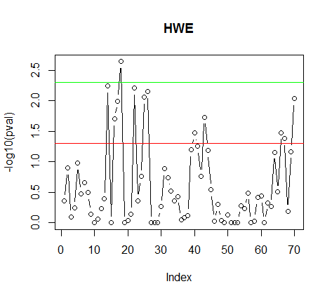

```

-------[p.176]-----------------------------------------------------

The SNP annotation and enrichment

＜準備＞
NCBI2RはCRANからremovedされていたので、
下記からtar.gzファイルをダウンロードします。
https://cran.r-project.org/src/contrib/Archive/NCBI2R/

NCBI2R_1.4.7.tar.gz


＜インストール＞
RstudioのTools→Install packagesで、
Install fromに「Package Archive File(.tar.gz)」を選択します。
ダウンロードしたファイルを選択して「Install」ボタンを押します。


> install.packages("C:/Users/ekaminuma/Downloads/NCBI2R_1.4.7.tar.gz", repos = NULL, type = "source")
Installing package into ‘C:/Users/ekaminuma/Documents/R/win-library/3.2’
(as ‘lib’ is unspecified)
* installing *source* package 'NCBI2R' ...
**  パッケージ 'NCBI2R' の解凍および MD5 サムの検証に成功しました 
** R
** data
** demo
** preparing package for lazy loading
** help
*** installing help indices
** building package indices
** testing if installed package can be loaded
*** arch - i386
*** arch - x64
* DONE (NCBI2R)
> 
> library(NCBI2R)


> mysnplist<-c("rs94","rs334","rs309","rs333","rs339")
> 

> mysnplist
[1] "rs94"  "rs334" "rs309" "rs333" "rs339"
> 


> FlankSeq <- GetSNPFlankSeq(mysnplist)
  |                                                                 |   0%NCBI2R beta version. Your version: 1.4.7 Latest Release 1.4.6
  |=================================================================| 100%

> FlankSeq
  marker variation
5   rs94         Y
3  rs334         N
1  rs309         Y
2  rs333         N
4  rs339         Y
                  fiveprime
5                                                                     atcacaaaagaagtgaatatgccctgccccaccttaactgatgacattccaccacaaaagaagtgtaaatggccggtccttgccttaagtgatgacattaccttgtgaaagtccttttcc
3                                                                                                 GCAATTTGTACTGATGGTATGGGGCCAAGAGATATATCTTAGAGGGAGGGCTGAGGGTTTGAAGTCCAACTCCTAAGCCAGTGCCAGAAGAGCCAAGGACAGGTACGGCTGTCATCACTTAGACCTCACCCTGTGGAGCCACACCCTAGGGTTGGCCAATCTACTCCCAGGAGCAGGGAGGGCAGGAGCCAGGGCTGGGCATAAAAGTCAGGGCAGAGCCATCTATTGCTTACATTTGCTTCTGACACAACTGTGTTCACTAGCAACCTCAAACAGACACCATGGTGCATCTGACTCCTG
1                                                                   

 


> Info <- GetSNPInfo(mysnplist)
Note: Some SNP locations could not be found. They have a chrpos of zero.
Some markers were not found. Will attempt a second method.
> 
> mysnplist
[1] "rs94"  "rs334" "rs309" "rs333" "rs339"
> 
> Info
  marker        genesymbol        locusID chr   chrpos
1   rs94                                             0
2  rs334               HBB           3043  11  5227002
3  rs309                                   12 92237146
4  rs333 LOC102724297,CCR5 102724297,1234   3 46373456
5  rs339            DNAH11           8701   7 21779927
                                    fxn_class      species dupl_loc
1                                             Homo sapiens         
2                          missense,reference Homo sapiens         
3                                             Homo sapiens         
4 frameshift-variant,intron-variant,reference Homo sapiens         
5                              intron-variant Homo sapiens         
  current.rsid flag
1         rs94    0
2        rs334    0
3        rs309    0
4        rs333    0
5        rs339    0


> Info$locusID
[1] ""               "3043"           ""               "102724297,1234"
[5] "8701"          
> 
> Info$locusID[2]
[1] "3043"
> 
> Info$locusID[4]
[1] "102724297,1234"
> 
> Info$locusID[5]
[1] "8701"

> pw4 <- GetPathways(Info$locusID[4])　どのSNPでも動かず
> pw4
[1] "No information found"　
> 

> tmpSNPs <- SplitGenes(Info)
The following SNP/s are located within more than one gene
 rs333  LOC102724297
> 

> tmppos <- GetSNPPosHapMap(mysnplist[2])
> tmppos
  chr  chrpos
1  11 5204808
> 

> 
> write(mysnplist,file="tmp_snplist.txt")


> 

tmp_snplist.txtの中身

rs94
rs334
rs309
rs333
rs339


-------------------------------------------

＜全SNPsで実行すると動かない＞

res0 <- AnnotateSNPFile("tmp_snplist.txt","tmp_snpann.htm")

(ERROR)


-----------------------------------------------


＃1SNPだけで試す、（skip機能がないので複数SNPまとめ実行に難あり）

> snp1<-c("rs12345")
> res1<-AnnotateSNPList(snp1,"tmp_snp1.html")
NCBI2R beta version. Your version: 1.4.7 Latest Release 1.4.6
[1] "GetSNPInfo has been performed and information for identified genes will now be found."
                                                           
Information for genes has been found - no genes listed have interim titles (i.e. temporary and unofficial names)
  |===========================================================================| 100%
HTML file was written at C:\Users\ekaminuma\Documents\tmp_snp1.html


-----------------------------------------------

＃動かないSNPを外すと通る


> snplist2 <- c("rs334","rs309")
> res2 <- AnnotateSNPList(snplist2,"tmp_snplist2.htm")
[1] "GetSNPInfo has been performed and information for identified genes will now be found."
                                                           
Information for genes has been found - AT LEAST one gene listed has  titles that are temporary or unofficial names)
  |===========================================================================| 100%
HTML file was written at C:\Users\ekaminuma\Documents\tmp_snplist2.htm


＃生成HTMLファイルは下記添付参照

------------------------------------------------


> genelist <- GetGenesInSNPs(mysnplist)
　　　　　SNPを含む遺伝子リストを取得
 Note: Some SNP locations could not be found. They have a chrpos of zero.
Some markers were not found. Will attempt a second method.
> 
> genelist
[1] "3043"           "102724297,1234" "8701"          
> 


> GetGenesInRegion("3",1,1000000)　1～1000000間にある遺伝子を取得

 [1] "10752"     "101927215" "100270871" "101927193" "402123"   
 [6] "285299"    "101927174" "105376922" "105376921" "105376920"
[11] "102723448" "101928695" "100508483"


-------[p.178]-----------------------------------------------------

Testing data for the Hardy-Weinberg equilibrium


HW連鎖不平衡とは

＊ Hardy-Weinbergの法則＝特定条件下で遺伝子型AA：Aa：aaの頻度はp2：2pq：q2

＊ Hardy-Weinbergの平衡検定＝対象集団での遺伝子型頻度の偏りを検定

＊HWE検定方法＝p2：2pq：q2　と実データの遺伝子型分離比のずれをPearson χ2検定やFisher正確確率検定で求める。

＊ゲノムワイド関連解析研究では、遺伝子型タイピングエラーの評価に利用する


閾値（http://www.ncbi.nlm.nih.gov/pmc/articles/PMC2894516/より抜粋）

The minimum SNP genotyping quality standards are HWE P-value

> 0.00033(GAIN Collaborative Research Group, 2007),

≥ 5.7 × 10−7 Wellcome Trust Case Control Consortium (WTCCC,2007),

> 0.001 Sladek et al. (2007),

≥ 10−6 Unoki et al. (2008)

参考URL
https://ja.wikipedia.org/wiki/%E3%83%8F%E3%83%BC%E3%83%87%E3%82%A3%E3%83%BC%E3%83%BB%E3%83%AF%E3%82%A4%E3%83%B3%E3%83%99%E3%83%AB%E3%82%AF%E3%81%AE%E6%B3%95%E5%89%87

http://www.dynacom.co.jp/product_service/packages/snpalyze/sa_t1_hwe.html

-----[先にp.180 11-14を実行]---------------------------------------------------

> source('SNPfreqCal.R') 

#HWExactが落ちるので使わない


> 
> library(SNPassoc)
 要求されたパッケージ haplo.stats をロード中です 
 要求されたパッケージ survival をロード中です 
 要求されたパッケージ mvtnorm をロード中です 
 要求されたパッケージ parallel をロード中です 
Warning messages:
1:  パッケージ ‘SNPassoc’ はバージョン 3.2.3 の R の下で造られました  
2:  パッケージ ‘haplo.stats’ はバージョン 3.2.4 の R の下で造られました  
3:  パッケージ ‘mvtnorm’ はバージョン 3.2.3 の R の下で造られました  
> 
> data(SNPs)
> 


> head(SNPs)
  id casco    sex blood.pre  protein snp10001 snp10002
1  1     1 Female      13.7 75640.52       TT       CC
2  2     1 Female      12.7 28688.22       TT       AC
3  3     1 Female      12.9 17279.59       TT       CC
4  4     1   Male      14.6 27253.99       CT       CC
5  5     1 Female      13.4 38066.57       TT       AC
6  6     1 Female      11.3  9872.46       TT       CC
  snp10003 snp10004 snp10005 snp10006 snp10007 snp10008
1       GG       GG       GG       AA       CC       CC
2       GG       GG       AG       AA       CC       CC
3       GG       GG       GG       AA       CC       CC
4       GG       GG       GG       AA       CC       CC
5       GG       GG       GG       AA       CC       CC
6       GG       GG       GG       AA       CC       CC


> freq2 <- freqCalc(SNPs,pat="snp")
> freq2
             nAA     nAa   naa
id           1.0    40.0    79
casco        0.0     0.0     1
blood.pre   10.8    12.3    13
protein   1615.0 25600.0 38330
snp10001    12.0    53.0    92
snp10002     5.0    78.0    74
snp10005     3.0    70.0    84
snp10008   104.0    44.0     9
snp100011    1.0     2.0   154
snp100019   32.0    75.0    50
snp100020    9.0    43.0   105

HWExact(freq2) (＃R3.2.2で落ちる)


----6:40列の遺伝子型データを抽出----------------------

> myData<-setupSNP(data=SNPs,colSNPs=6:40,sep="")


> summary(myData)
          alleles major.allele.freq HWE      missing (%)
snp10001  T/C      75.5             0.281639  0.0      
snp10002  C/A      72.0             0.004945  0.0      
snp10003  G       100.0             -         8.3      
snp10004  G       100.0             -         0.6      
snp10005  G/A      75.8             0.008020  0.0      
snp10006  A       100.0             -         0.0      
snp10007  C       100.0             -         0.0      
snp10008  C/G      80.3             0.137802  0.0      
snp10009  A/G      71.5             0.002848  0.6      
snp100010 T       100.0             -         6.4      
snp100011 G/C      98.7             0.019139  0.0      
snp100012 G/C      76.1             0.013399  1.3      
snp100013 A/G      81.7             0.025588  7.6      
snp100014 C/A      58.2             1.000000  2.5      
snp100015 G/A      95.9             1.000000  0.0      
snp100016 G       100.0             -         3.2      
snp100017 T/C      70.0             0.000518  1.3      
snp100018 T/C      69.9             0.000498  0.6      
snp100019 G/C      55.7             0.746284  0.0      
snp100020 G/A      80.6             0.125355  0.0      
snp100021 G       100.0             -         0.0      
snp100022 A       100.0             -         0.6      
snp100023 T/A      71.4             0.002842  1.9      
snp100024 T/C      74.7             0.092210  0.6      
snp100025 C       100.0             -         0.0      
snp100026 G       100.0             -         0.6      
snp100027 C/G      70.3             0.000896  1.3      
snp100028 T/C      55.1             0.419687  0.6      
snp100029 G/A      75.6             0.048709  0.6      
snp100030 A       100.0             -         0.0      
snp100031 T       100.0             -        35.0      
snp100032 G/A      55.8             0.258909  0.6      
snp100033 G/A      54.9             0.326373  3.2      
snp100034 T/C      75.6             0.048709  0.6      
snp100035 T       100.0             -         7.0      
> 

#-------1SNPのみを抽出----------------------

> mySNP<-snp(SNPs$snp10001,sep="")
> mySNP
  [1] T/T T/T T/T C/T T/T T/T T/T T/T C/T T/T C/T C/C C/T T/T T/T T/T C/T T/T T/T T/T
 [21] T/T C/C C/T T/T T/T C/T T/T T/T T/T C/C T/T T/T C/T T/T C/T C/T C/C C/T C/T T/T
 [41] T/T T/T T/T C/T T/T C/C C/T C/T C/T T/T T/T C/T C/T T/T T/T T/T T/T T/T C/T T/T
 [61] T/T T/T T/T T/T T/T T/T C/C T/T T/T C/T C/T T/T T/T C/T T/T T/T T/T T/T T/T C/T
 [81] C/T T/T T/T T/T C/C T/T T/T C/C C/C C/T T/T T/T C/T T/T T/T T/T T/T T/T C/T T/T
[101] C/T C/T C/T T/T T/T C/C C/T T/T T/T C/T T/T C/T C/T T/T C/T C/T T/T T/T C/T C/T
[121] C/T T/T C/C T/T T/T T/T T/T T/T C/T T/T C/T C/C T/T C/T C/T T/T C/T T/T T/T C/T
[141] C/T C/T T/T T/T T/T T/T C/T T/T T/T T/T T/T C/T T/T C/T C/T C/T C/T
Genotypes: T/T C/T C/C
Alleles:  T C 


> summary(mySNP)
Genotypes: 
    frequency percentage
T/T        92  58.598726
C/T        53  33.757962
C/C        12   7.643312

Alleles: 
  frequency percentage
T       237   75.47771
C        77   24.52229

HWE (p value): 0.2816392 


棒グラフ表示

> plot(mySNP,label="snp10001",col="darkgreen") 


pie chart表示
> plot(mySNP,type=pie,label="snp10001",col=c("darkgreen","yellow","red"))


-----[後でp.170 1-10を実行]---------------------------------------------------

> install.packages("GWASExactHW") 
Installing package into ‘C:/Users/ekaminuma/Documents/R/win-library/3.2’
(as ‘lib’ is unspecified)
trying URL 'http://cran.rstudio.com/bin/windows/contrib/3.2/GWASExactHW_1.01.zip'
Content type 'application/zip' length 26122 bytes (25 KB)
downloaded 25 KB

> library(GWASExactHW)
Warning message:
 パッケージ ‘GWASExactHW’ はバージョン 3.2.3 の R の下で造られました


---------------------------------------------


> pA <- runif(1) 

> pA
[1] 0.5450312

> 

> pA
[1] 0.02012086
> 
> pAA <- pA^2 
> pAA
[1] 0.000404849
> 
> pAa <- 2*pA*(1-pA)
> pAa
[1] 0.03943202
> 
> paa <- (1-pA)^2
> paa
[1] 0.9601631
> 
> myCounts <- rmultinom(100, 500, c(pAA, pAa, paa)) 
> 
> myCounts
     [,1] [,2] [,3] [,4] [,5] [,6] [,7] [,8] [,9] [,10] [,11] [,12] [,13] [,14]
[1,]    0    0    0    0    0    0    0    0    0     0     0     0     0     1
[2,]   22   18   21   23   24   19   25   21   14    16    22    20    18    22
[3,]  478  482  479  477  476  481  475  479  486   484   478   480   482   477

＜略＞

     [,93] [,94] [,95] [,96] [,97] [,98] [,99] [,100]
[1,]     0     0     0     0     1     0     1      0
[2,]    14    24    20    17    19    21    15     17
[3,]   486   476   480   483   480   479   484    483


> genotypes <- data.frame(t(myCounts))
> genotypes
    X1 X2  X3
1    0 22 478
2    0 18 482
3    0 21 479
4    0 23 477
5    0 24 476
6    0 19 481
7    0 25 475
8    0 21 479
9    0 14 486
10   0 16 484
11   0 22 478

＜略＞

94   0 24 476
95   0 20 480
96   0 17 483
97   1 19 480
98   0 21 479
99   1 15 484
100  0 17 483


 

> colnames(genotypes)= c("nAA", "nAa", "naa") 

> head(genotypes)
  nAA nAa naa
1   0  22 478
2   0  18 482
3   0  21 479
4   0  23 477
5   0  24 476
6   0  19 481

> hwpval<- HWExact(genotypes)
> 
> hwpval
  [1] 1.00000000 1.00000000 1.00000000 1.00000000 1.00000000 1.00000000 1.00000000
  [8] 1.00000000 1.00000000 1.00000000 1.00000000 1.00000000 1.00000000 0.24623098
 [15] 1.00000000 1.00000000 1.00000000 1.00000000 1.00000000 1.00000000 0.05121255
＜中略＞
 [92] 1.00000000 1.00000000 1.00000000 1.00000000 1.00000000 0.19298312 1.00000000
 [99] 0.12915223 1.00000000
> 

> load("Alzheimers.rda"); データ読込み（Alzheimers.rdaを準備しておく）
> 
> head(Alzheimers)
                nAA nAa naa
rs419010.cases  112 278 150
rs394221.cases  149 269  91
rs4803766.cases 136 273 130
rs395908.cases  228 240  70
rs519113.cases  237 226  73
rs12776.cases   245 230  65

> myTest <- HWExact(Alzheimers)
> myTest
 [1] 0.437554089 0.126814962 0.796360579 0.572451655 0.105917963
 [6] 0.333687463 0.221715065 0.319373883 0.717230915 1.000000000
[11] 0.857620542 0.589781575 0.405406376 0.005735119 1.000000000
[16] 0.019801568 0.010132429 0.002286626 1.000000000 0.902951141
[21] 0.713326619 0.006166348 0.431501503 0.174111296 0.008769578
[26] 0.007110096 1.000000000 1.000000000 1.000000000 0.540716547
[31] 0.130288559 0.182900099 0.299439622 0.437648348 0.371108411
[36] 0.879707374 0.814756375 0.750185547 0.063450753 0.033904469
[41] 0.055769124 0.173022198 0.018569110 0.065002238 0.288950668
[46] 0.939763400 0.501155510 0.915136410 1.000000000 0.748772759
[51] 1.000000000 1.000000000 1.000000000 0.525290005 0.583730382
[56] 0.323167419 1.000000000 0.939014881 0.384031082 0.366025296
[61] 1.000000000 0.467237328 0.532750303 0.069734589 0.313206777
[66] 0.033336334 0.041363824 0.640511225 0.067880820 0.009258245
> 
> names(myTest) <- rownames(Alzheimers)
> names(myTest) 
 [1] "rs419010.cases"     "rs394221.cases"     "rs4803766.cases"   
 [4] "rs395908.cases"     "rs519113.cases"     "rs12776.cases"     
 [7] "rs3865427.cases"    "rs3852860.cases"    "rs3852861.cases"   
[10] "rs6857.cases"       "rs157580.cases"     "rs157581.cases"    
[13] "rs157582.cases"     "rs157583.cases"     "rs1160983.cases"   
[16] "rs157587.cases"     "rs283817.cases"     "rs573199.cases"    
[19] "rs1160985.cases"    "rs760136.cases"     "rs741780.cases"    
[22] "rs394819.cases"     "rs405697.cases"     "rs10119.cases"     
[25] "rs446037.cases"     "rs434132.cases"     "rs7259620.cases"   
[28] "rs449647.cases"     "rs769446.cases"     "rs440446.cases"    
[31] "rs429358.cases"     "rs7256200.cases"    "rs483082.cases"    
[34] "rs584007.cases"     "rs4420638.cases"    "rs419010.controls" 
[37] "rs394221.controls"  "rs4803766.controls" "rs395908.controls" 
[40] "rs519113.controls"  "rs12776.controls"   "rs3865427.controls"
[43] "rs3852860.controls" "rs3852861.controls" "rs6857.controls"   
[46] "rs157580.controls"  "rs157581.controls"  "rs157582.controls" 
[49] "rs157583.controls"  "rs1160983.controls" "rs157587.controls" 
[52] "rs283817.controls"  "rs573199.controls"  "rs1160985.controls"
[55] "rs760136.controls"  "rs741780.controls"  "rs394819.controls" 
[58] "rs405697.controls"  "rs10119.controls"   "rs446037.controls" 
[61] "rs434132.controls"  "rs7259620.controls" "rs449647.controls" 
[64] "rs769446.controls"  "rs440446.controls"  "rs429358.controls" 
[67] "rs7256200.controls" "rs483082.controls"  "rs584007.controls" 
[70] "rs4420638.controls"


> plot(-log10(myTest),type="b",ylab="-log10(pval)", main="HWE")
> 
> abline(h=-log10(0.05),col="red")

> abline(h=-log10(0.005),col="green")
```

```


HWEで有意なSNPのみを抽出

> sum(myTest<0.05)  12個のSNPが有意だった
[1] 12
> 
> names(myTest)
 [1] "rs419010.cases"     "rs394221.cases"     "rs4803766.cases"   
 [4] "rs395908.cases"     "rs519113.cases"     "rs12776.cases"   ：
　略 


> names(myTest)[which(myTest<0.05)]　全有意SNPsのID取得
 [1] "rs157583.cases"     "rs157587.cases"     "rs283817.cases"    
 [4] "rs573199.cases"     "rs394819.cases"     "rs446037.cases"    
 [7] "rs434132.cases"     "rs519113.controls"  "rs3852860.controls"
[10] "rs429358.controls"  "rs7256200.controls" "rs4420638.controls"
> 


```


