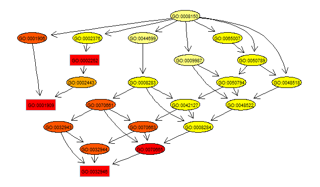

# BioinfoTraining15  
「Bioinformatics with R Cookbook」2015年度輪読会

初心者向けBioinformatics輪読演習を行います(NIG遺伝研大量遺伝　神沼)

* ＊ノートパソコン必携
* ＊演習形式
* ＊隔週月曜日11:00-12:00 NIG-W403

開催日

|    | 日時  |  ページ |　内容  | 
|---|---|---|---| 
|1回目  | [2015/4/6](150406.md)  11:00-12:00  | 7-15　| 基本操作[class,dim,iris data, etc]  |
|2回目  | [2015/4/20](150420.md)  11:00-12:00  | 15-18　| 基本操作[str,rnorm,subset,etc]  |
|3回目  | [2015/5/12](150512.md)  11:00-12:00(11日から変更しました)  | 19-28　| 基本統計量, 検定, plot視覚化  |
|4回目  | [2015/5/25](150525.md)  11:00-12:00  | 29-32　| NCBI Entrez, EUtils*  |
|4回目補講  | [2015/5/25補講](150525sup.md)  11:00-12:00  | 23-25　| t検定, t統計量   |
|5回目  | [2015/6/8](150608.md)  11:00-12:00  | 33-35 | Biomart  |
|6回目  | [2015/6/23](150623.md)(火)  11:00-12:00(22から変更しました15/5/25)  | 271-274　| k-means, AIC/BIC   |
|7回目  | [2015/7/6](150706.md)  11:00-12:00  | 275-281　| Cluster dendrogram, Silhouette plot  |
|8回目  | [2015/7/21](150721.md)(火) 13:30-14:30 |282-285　| LDA, DecisionTree, SVM  |
|9回目  | [2015/8/3](150803.md)  11:00-12:00  | 286-292　| Naive Bayes, Bootstrapping, Cross-validation  |
|10回目  | [2015/9/7](150907.md)  11:00-12:00  | 293-298 　|ROC curve, AUC  |
|11回目  | [2015/10/6](151006.md)  11:00-12:00  | 37-46 　|Bioconductor, HGU133 Array, KEGG  |
|12回目  | [2015/10/13](151013.md)(火)  13:30-14:30  | 46-48 　|Bioconductor, GO  |
|13回目  | [2015/10/27](151027.md)(火) 11:00-12:00(26日から変更しました) | 48-56 | Gene enrichment test(GO, KEGG pathway) |
|14回目  | [2015/11/5](151105.md)(木) 11:00-12:00(9日から変更しました) | 57-68 | GenBank, fasta, GC content |
|15回目  | [2015/11/24](151124.md)  11:00-12:00  | 46-48 　|Bioconductor, GO  |
|16回目  | [2015/12/7](151207.md)  11:00-12:00  | 46-48 　|Bioconductor, GO  |

開催予定日

- 17回目 2015/12/21  11:00-12:00
- 18回目 2016/1/7　 11:00-12:00
- 19回目 2016/1/18　 11:00-12:00
- 20回目 2016/2/1　 11:00-12:00
- 21回目 2016/2/15　 11:00-12:00
- 22回目 2016/3/7　 11:00-12:00
- 23回目 2016/3/22　 11:00-12:00

